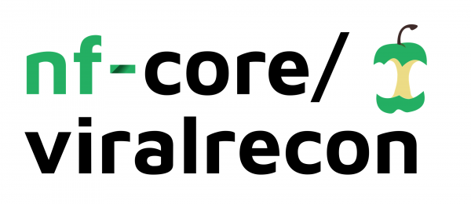

# 

[](https://github.com/nf-core/viralrecon/actions)
[](https://github.com/nf-core/viralrecon/actions)
[](https://www.nextflow.io/)

[](http://bioconda.github.io/)
[](https://hub.docker.com/r/nfcore/viralrecon)

## Introduction

**nfcore/viralrecon** is a bioinformatics analysis pipeline used to perform assembly and intrahost/low-frequency variant calling for viral samples. The pipeline currently supports metagenomics and amplicon sequencing data derived from the Illumina sequencing platform.

This pipeline is a re-implementation of the [SARS_Cov2_consensus-nf](https://github.com/BU-ISCIII/SARS_Cov2_consensus-nf) and [SARS_Cov2_assembly-nf](https://github.com/BU-ISCIII/SARS_Cov2_assembly-nf) pipelines initially developed by [Sarai Varona](https://github.com/svarona) and [Sara Monzon](https://github.com/saramonzon) from [BU-ISCIII](https://github.com/BU-ISCIII). Porting both of these pipelines to nf-core was an international collaboration between numerous contributors and developers, led by [Harshil Patel](https://github.com/drpatelh) from the [The Bioinformatics & Biostatistics Group](https://www.crick.ac.uk/research/science-technology-platforms/bioinformatics-and-biostatistics/) at [The Francis Crick Institute](https://www.crick.ac.uk/), London. We appreciated the need to have a portable, reproducible and scalable pipeline for the analysis of COVID-19 sequencing samples and so the Avengers Assembled! Please come and join us and add yourself to the contributor list :)

We have integrated a number of options in the pipeline to allow you to run specific aspects of the workflow if you so wish. For example, you can skip all of the assembly steps with the `--skip_assembly` parameter. See [usage docs](docs/usage.md) for all of the available options when running the pipeline. Please click [here](https://raw.githack.com/nf-core/viralrecon/master/docs/html/multiqc_report.html) to see an example MultiQC report generated using the parameters defined in [this](../conf/test_full.config) file to run the pipeline on [samples](https://zenodo.org/record/3735111) which were prepared from the [ncov-2019 ARTIC Network V1 amplicon set](https://artic.network/ncov-2019) and sequenced on the Illumina MiSeq platform in 301bp paired-end format.

The pipeline is built using [Nextflow](https://www.nextflow.io), a workflow tool to run tasks across multiple compute infrastructures in a very portable manner. It comes with docker containers making installation trivial and results highly reproducible.

## Pipeline summary

1. Download samples via SRA, ENA or GEO ids ([`ENA FTP`](https://ena-docs.readthedocs.io/en/latest/retrieval/file-download.html), [`parallel-fastq-dump`](https://github.com/rvalieris/parallel-fastq-dump); *if required*)
2. Merge re-sequenced FastQ files ([`cat`](http://www.linfo.org/cat.html); *if required*)
3. Read QC ([`FastQC`](https://www.bioinformatics.babraham.ac.uk/projects/fastqc/))
4. Adapter trimming ([`fastp`](https://github.com/OpenGene/fastp))
5. Variant calling
    1. Read alignment ([`Bowtie 2`](http://bowtie-bio.sourceforge.net/bowtie2/index.shtml))
    2. Sort and index alignments ([`SAMtools`](https://sourceforge.net/projects/samtools/files/samtools/))
    3. Primer sequence removal ([`iVar`](https://github.com/andersen-lab/ivar); *amplicon data only*)
    4. Duplicate read marking ([`picard`](https://broadinstitute.github.io/picard/); *removal optional*)
    5. Alignment-level QC ([`picard`](https://broadinstitute.github.io/picard/), [`SAMtools`](https://sourceforge.net/projects/samtools/files/samtools/))
    6. Choice of multiple variant calling and consensus sequence generation routes ([`VarScan 2`](http://dkoboldt.github.io/varscan/), [`BCFTools`](http://samtools.github.io/bcftools/bcftools.html), [`BEDTools`](https://github.com/arq5x/bedtools2/) *||* [`iVar variants and consensus`](https://github.com/andersen-lab/ivar) *||* [`BCFTools`](http://samtools.github.io/bcftools/bcftools.html), [`BEDTools`](https://github.com/arq5x/bedtools2/))
        * Variant annotation ([`SnpEff`](http://snpeff.sourceforge.net/SnpEff.html), [`SnpSift`](http://snpeff.sourceforge.net/SnpSift.html))
        * Consensus assessment report ([`QUAST`](http://quast.sourceforge.net/quast))
6. _De novo_ assembly
    1. Primer trimming ([`Cutadapt`](https://cutadapt.readthedocs.io/en/stable/guide.html); *amplicon data only*)
    2. Removal of host reads ([`Kraken 2`](http://ccb.jhu.edu/software/kraken2/))
    3. Choice of multiple assembly tools ([`SPAdes`](http://cab.spbu.ru/software/spades/) *||* [`metaSPAdes`](http://cab.spbu.ru/software/meta-spades/) *||* [`Unicycler`](https://github.com/rrwick/Unicycler) *||* [`minia`](https://github.com/GATB/minia))
        * Blast to reference genome ([`blastn`](https://blast.ncbi.nlm.nih.gov/Blast.cgi?PAGE_TYPE=BlastSearch))
        * Contiguate assembly ([`ABACAS`](https://www.sanger.ac.uk/science/tools/pagit))
        * Assembly report ([`PlasmidID`](https://github.com/BU-ISCIII/plasmidID))
        * Assembly assessment report ([`QUAST`](http://quast.sourceforge.net/quast))
        * Call variants relative to reference ([`Minimap2`](https://github.com/lh3/minimap2), [`seqwish`](https://github.com/ekg/seqwish), [`vg`](https://github.com/vgteam/vg), [`Bandage`](https://github.com/rrwick/Bandage))
        * Variant annotation ([`SnpEff`](http://snpeff.sourceforge.net/SnpEff.html), [`SnpSift`](http://snpeff.sourceforge.net/SnpSift.html))
7. Present QC and visualisation for raw read, alignment, assembly and variant calling results ([`MultiQC`](http://multiqc.info/))

## Quick Start

i. Install [`nextflow`](https://nf-co.re/usage/installation)

ii. Install either [`Docker`](https://docs.docker.com/engine/installation/) or [`Singularity`](https://www.sylabs.io/guides/3.0/user-guide/) for full pipeline reproducibility (please only use [`Conda`](https://conda.io/miniconda.html) as a last resort; see [docs](https://nf-co.re/usage/configuration#basic-configuration-profiles))

iii. Download the pipeline and test it on a minimal dataset with a single command

```bash
nextflow run nf-core/viralrecon -profile test,<docker/singularity/conda/institute>
```

> Please check [nf-core/configs](https://github.com/nf-core/configs#documentation) to see if a custom config file to run nf-core pipelines already exists for your Institute. If so, you can simply use `-profile <institute>` in your command. This will enable either `docker` or `singularity` and set the appropriate execution settings for your local compute environment.

iv. Start running your own analysis!

```bash
nextflow run nf-core/viralrecon -profile <docker/singularity/conda/institute> --input samplesheet.csv --genome 'NC_045512.2' -profile docker
```

See [usage docs](docs/usage.md) for all of the available options when running the pipeline.

## Documentation

The nf-core/viralrecon pipeline comes with documentation about the pipeline, found in the `docs/` directory:

1. [Installation](https://nf-co.re/usage/installation)
2. Pipeline configuration
    * [Local installation](https://nf-co.re/usage/local_installation)
    * [Adding your own system config](https://nf-co.re/usage/adding_own_config)
    * [Reference genomes](docs/usage.md#reference-genomes)
3. [Running the pipeline](docs/usage.md)
4. [Output and how to interpret the results](docs/output.md)
5. [Troubleshooting](https://nf-co.re/usage/troubleshooting)

## Credits

nf-core/viralrecon was originally written by Sarai Varona, Miguel Juliá and Sara Monzon from [BU-ISCIII](https://github.com/BU-ISCIII) and co-ordinated by Isabel Cuesta for the [Institute of Health Carlos III](https://eng.isciii.es/eng.isciii.es/Paginas/Inicio.html), Spain. Through collaboration with the nf-core community the pipeline has now been updated substantially to include additional processing steps, to standardise inputs/outputs and to improve the pipeline reporting.

Many thanks to others who have helped out and contributed along the way too, including (but not limited to):

| Name                                                      | Affiliation                                                                           |
|-----------------------------------------------------------|---------------------------------------------------------------------------------------|
| [Alexander Peltzer](https://github.com/apeltzer)          | [Boehringer Ingelheim, Germany](https://www.boehringer-ingelheim.de/)                 |
| [Alison Meynert](https://github.com/ameynert)             | [University of Edinburgh, Scotland](https://www.ed.ac.uk/)                            |
| [Edgar Garriga Nogales](https://github.com/edgano)        | [Centre for Genomic Regulation, Spain](https://www.crg.eu/)                           |
| [Erik Garrison](https://github.com/ekg)                   | [UCSC, USA](https://www.ucsc.edu/)                                                    |
| [Gisela Gabernet](https://github.com/ggabernet)           | [QBiC, University of Tübingen, Germany](https://portal.qbic.uni-tuebingen.de/portal/) |
| [Joao Curado](https://github.com/jcurado-flomics)         | [Flomics Biotech, Spain](https://www.flomics.com/)                                    |
| [Jose Espinosa-Carrasco](https://github.com/JoseEspinosa) | [Centre for Genomic Regulation, Spain](https://www.crg.eu/)                           |
| [Katrin Sameith](https://github.com/ktrns)                | [DRESDEN-concept Genome Center, Germany](https://genomecenter.tu-dresden.de)          |
| [Marta Pozuelo](https://github.com/mpozuelo-flomics)      | [Flomics Biotech, Spain](https://www.flomics.com/)                                    |
| [Maxime Garcia](https://github.com/MaxUlysse)             | [SciLifeLab, Sweden](https://www.scilifelab.se/)                                      |
| [Michael Heuer](https://github.com/heuermh)               | [UC Berkeley, USA](https://https://rise.cs.berkeley.edu)                              |
| [Phil Ewels](https://github.com/ewels)                    | [SciLifeLab, Sweden](https://www.scilifelab.se/)                                      |
| [Simon Heumos](https://github.com/subwaystation)          | [QBiC, University of Tübingen, Germany](https://portal.qbic.uni-tuebingen.de/portal/) |
| [Stephen Kelly](https://github.com/stevekm)               | [Memorial Sloan Kettering Cancer Center, USA](https://www.mskcc.org/)                 |
| [Thanh Le Viet](https://github.com/thanhleviet)           | [Quadram Institute, UK](https://quadram.ac.uk/)                                       |

> Listed in alphabetical order

## Contributions and Support

If you would like to contribute to this pipeline, please see the [contributing guidelines](.github/CONTRIBUTING.md).

For further information or help, don't hesitate to get in touch on [Slack](https://nfcore.slack.com/channels/viralrecon) (you can join with [this invite](https://nf-co.re/join/slack)).

## Citation

<!-- If you use  nf-core/viralrecon for your analysis, please cite it using the following doi: [10.5281/zenodo.XXXXXX](https://doi.org/10.5281/zenodo.XXXXXX) -->

You can cite the `nf-core` publication as follows:

> **The nf-core framework for community-curated bioinformatics pipelines.**
>
> Philip Ewels, Alexander Peltzer, Sven Fillinger, Harshil Patel, Johannes Alneberg, Andreas Wilm, Maxime Ulysse Garcia, Paolo Di Tommaso & Sven Nahnsen.
>
> _Nat Biotechnol._ 2020 Feb 13. doi: [10.1038/s41587-020-0439-x](https://dx.doi.org/10.1038/s41587-020-0439-x).
> ReadCube: [Full Access Link](https://rdcu.be/b1GjZ)

An extensive list of references for the tools used by the pipeline can be found in the [`CITATIONS.md`](CITATIONS.md) file.
