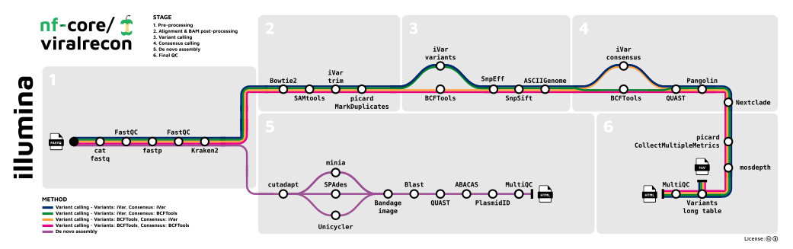
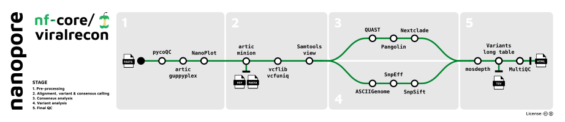

<h1>
  <picture>
    <source media="(prefers-color-scheme: dark)" srcset="docs/images/nf-core-viralrecon_logo_dark.png">
    
  </picture>
</h1>

[](https://github.com/nf-core/viralrecon/actions/workflows/ci.yml)
[](https://github.com/nf-core/viralrecon/actions/workflows/linting.yml)[](https://nf-co.re/viralrecon/results)[](https://doi.org/10.5281/zenodo.XXXXXXX)
[](https://www.nf-test.com)

[](https://www.nextflow.io/)
[](https://docs.conda.io/en/latest/)
[](https://www.docker.com/)
[](https://sylabs.io/docs/)
[](https://cloud.seqera.io/launch?pipeline=https://github.com/nf-core/viralrecon)

[](https://nfcore.slack.com/channels/viralrecon)[](https://twitter.com/nf_core)[](https://mstdn.science/@nf_core)[](https://www.youtube.com/c/nf-core)

## Introduction

**nf-core/viralrecon** is a bioinformatics analysis pipeline used to perform assembly and intra-host/low-frequency variant calling for viral samples. The pipeline supports both Illumina and Nanopore sequencing data. For Illumina short-reads the pipeline is able to analyse metagenomics data typically obtained from shotgun sequencing (e.g. directly from clinical samples) and enrichment-based library preparation methods (e.g. amplicon-based: [ARTIC SARS-CoV-2 enrichment protocol](https://artic.network/ncov-2019); or probe-capture-based). For Nanopore data the pipeline only supports amplicon-based analysis obtained from primer sets created and maintained by the [ARTIC Network](https://artic.network/).

On release, automated continuous integration tests run the pipeline on a full-sized dataset on the AWS cloud infrastructure. This ensures that the pipeline runs on AWS, has sensible resource allocation defaults set to run on real-world datasets, and permits the persistent storage of results to benchmark between pipeline releases and other analysis sources. The results obtained from running the full-sized tests individually for each `--platform` option can be viewed on the [nf-core website](https://nf-co.re/viralrecon/results) and the output directories will be named accordingly i.e. `platform_illumina/` and `platform_nanopore/`.

The pipeline is built using [Nextflow](https://www.nextflow.io), a workflow tool to run tasks across multiple compute infrastructures in a very portable manner. It uses Docker/Singularity containers making installation trivial and results highly reproducible. The [Nextflow DSL2](https://www.nextflow.io/docs/latest/dsl2.html) implementation of this pipeline uses one container per process which makes it much easier to maintain and update software dependencies. Where possible, these processes have been submitted to and installed from [nf-core/modules](https://github.com/nf-core/modules) in order to make them available to all nf-core pipelines, and to everyone within the Nextflow community!

## Pipeline summary

The pipeline has numerous options to allow you to run only specific aspects of the workflow if you so wish. For example, for Illumina data you can skip the host read filtering step with Kraken 2 with `--skip_kraken2` or you can skip all of the assembly steps with the `--skip_assembly` parameter. See the [usage](https://nf-co.re/viralrecon/usage) and [parameter](https://nf-co.re/viralrecon/parameters) docs for all of the available options when running the pipeline.

The SRA download functionality has been removed from the pipeline (`>=2.1`) and ported to an independent workflow called [nf-core/fetchngs](https://nf-co.re/fetchngs). You can provide `--nf_core_pipeline viralrecon` when running nf-core/fetchngs to download and auto-create a samplesheet containing publicly available samples that can be accepted directly by the Illumina processing mode of nf-core/viralrecon.

A number of improvements were made to the pipeline recently, mainly with regard to the variant calling. Please see [Major updates in v2.3](https://github.com/nf-core/viralrecon/issues/271) for a more detailed description.

### Illumina



1. Merge re-sequenced FastQ files ([`cat`](http://www.linfo.org/cat.html))
2. Read QC ([`FastQC`](https://www.bioinformatics.babraham.ac.uk/projects/fastqc/))
3. Adapter trimming ([`fastp`](https://github.com/OpenGene/fastp))
4. Removal of host reads ([`Kraken 2`](http://ccb.jhu.edu/software/kraken2/); _optional_)
5. Variant calling
   1. Read alignment ([`Bowtie 2`](http://bowtie-bio.sourceforge.net/bowtie2/index.shtml))
   2. Sort and index alignments ([`SAMtools`](https://sourceforge.net/projects/samtools/files/samtools/))
   3. Primer sequence removal ([`iVar`](https://github.com/andersen-lab/ivar); _amplicon data only_)
   4. Duplicate read marking ([`picard`](https://broadinstitute.github.io/picard/); _optional_)
   5. Alignment-level QC ([`picard`](https://broadinstitute.github.io/picard/), [`SAMtools`](https://sourceforge.net/projects/samtools/files/samtools/))
   6. Genome-wide and amplicon coverage QC plots ([`mosdepth`](https://github.com/brentp/mosdepth/))
   7. Choice of multiple variant callers ([`iVar variants`](https://github.com/andersen-lab/ivar); _default for amplicon data_ _||_ [`BCFTools`](http://samtools.github.io/bcftools/bcftools.html); _default for metagenomics data_)
      - Variant annotation ([`SnpEff`](http://snpeff.sourceforge.net/SnpEff.html), [`SnpSift`](http://snpeff.sourceforge.net/SnpSift.html))
      - Individual variant screenshots with annotation tracks ([`ASCIIGenome`](https://asciigenome.readthedocs.io/en/latest/))
   8. Choice of multiple consensus callers ([`BCFTools`](http://samtools.github.io/bcftools/bcftools.html), [`BEDTools`](https://github.com/arq5x/bedtools2/); _default for both amplicon and metagenomics data_ _||_ [`iVar consensus`](https://github.com/andersen-lab/ivar))
      - Consensus assessment report ([`QUAST`](http://quast.sourceforge.net/quast))
      - Lineage analysis ([`Pangolin`](https://github.com/cov-lineages/pangolin))
      - Clade assignment, mutation calling and sequence quality checks ([`Nextclade`](https://github.com/nextstrain/nextclade))
   9. Relative lineage abundance analysis from mixed SARS-CoV-2 samples ([`Freyja`](https://github.com/andersen-lab/Freyja))
   10. Create variants long format table collating per-sample information for individual variants ([`BCFTools`](http://samtools.github.io/bcftools/bcftools.html)), functional effect prediction ([`SnpSift`](http://snpeff.sourceforge.net/SnpSift.html)) and lineage analysis ([`Pangolin`](https://github.com/cov-lineages/pangolin))
6. _De novo_ assembly
   1. Primer trimming ([`Cutadapt`](https://cutadapt.readthedocs.io/en/stable/guide.html); _amplicon data only_)
   2. Choice of multiple assembly tools ([`SPAdes`](http://cab.spbu.ru/software/spades/) _||_ [`Unicycler`](https://github.com/rrwick/Unicycler) _||_ [`minia`](https://github.com/GATB/minia))
      - Blast to reference genome ([`blastn`](https://blast.ncbi.nlm.nih.gov/Blast.cgi?PAGE_TYPE=BlastSearch))
      - Contiguate assembly ([`ABACAS`](https://www.sanger.ac.uk/science/tools/pagit))
      - Assembly report ([`PlasmidID`](https://github.com/BU-ISCIII/plasmidID))
      - Assembly assessment report ([`QUAST`](http://quast.sourceforge.net/quast))
7. Present QC and visualisation for raw read, alignment, assembly and variant calling results ([`MultiQC`](http://multiqc.info/))

### Nanopore



1. Sequencing QC ([`pycoQC`](https://github.com/a-slide/pycoQC))
2. Aggregate pre-demultiplexed reads from MinKNOW/Guppy ([`artic guppyplex`](https://artic.readthedocs.io/en/latest/commands/))
3. Read QC ([`NanoPlot`](https://github.com/wdecoster/NanoPlot))
4. Align reads, call variants and generate consensus sequence ([`artic minion`](https://artic.readthedocs.io/en/latest/commands/))
5. Remove unmapped reads and obtain alignment metrics ([`SAMtools`](https://sourceforge.net/projects/samtools/files/samtools/))
6. Genome-wide and amplicon coverage QC plots ([`mosdepth`](https://github.com/brentp/mosdepth/))
7. Downstream variant analysis:
   - Count metrics ([`BCFTools`](http://samtools.github.io/bcftools/bcftools.html))
   - Variant annotation ([`SnpEff`](http://snpeff.sourceforge.net/SnpEff.html), [`SnpSift`](http://snpeff.sourceforge.net/SnpSift.html))
   - Consensus assessment report ([`QUAST`](http://quast.sourceforge.net/quast))
   - Lineage analysis ([`Pangolin`](https://github.com/cov-lineages/pangolin))
   - Clade assignment, mutation calling and sequence quality checks ([`Nextclade`](https://github.com/nextstrain/nextclade))
   - Individual variant screenshots with annotation tracks ([`ASCIIGenome`](https://asciigenome.readthedocs.io/en/latest/))
   - Recover relative lineage abundances from mixed SARS-CoV-2 samples ([`Freyja`](https://github.com/andersen-lab/Freyja))
   - Create variants long format table collating per-sample information for individual variants ([`BCFTools`](http://samtools.github.io/bcftools/bcftools.html)), functional effect prediction ([`SnpSift`](http://snpeff.sourceforge.net/SnpSift.html)) and lineage analysis ([`Pangolin`](https://github.com/cov-lineages/pangolin))
8. Present QC, visualisation and custom reporting for sequencing, raw reads, alignment and variant calling results ([`MultiQC`](http://multiqc.info/))

## Usage

> [!NOTE]
> If you are new to Nextflow and nf-core, please refer to [this page](https://nf-co.re/docs/usage/installation) on how
> to set-up Nextflow. Make sure to [test your setup](https://nf-co.re/docs/usage/introduction#how-to-run-a-pipeline)
> with `-profile test` before running the workflow on actual data.

First, prepare a samplesheet with your input data that looks as follows:

`samplesheet.csv`:

```csv
sample,fastq_1,fastq_2
SAMPLE_1,AEG588A1_S1_L002_R1_001.fastq.gz,AEG588A1_S1_L002_R2_001.fastq.gz
```

Each row represents a fastq file (single-end) or a pair of fastq files (paired end). Rows with the same sample identifier are considered technical replicates and merged automatically.

### Typical commands

#### Illumina shotgun analysis

```bash
nextflow run nf-core/viralrecon \
   --input samplesheet.csv \
   --outdir <OUTDIR> \
   --platform illumina \
   --protocol metagenomic \
   --genome 'MN908947.3' \
   -profile -profile <docker/singularity/.../institute>
```

#### Illumina amplicon analysis

```bash
nextflow run nf-core/viralrecon \
   --input samplesheet.csv \
   --outdir <OUTDIR> \
   --platform illumina \
   --protocol amplicon \
   --genome 'MN908947.3' \
   --primer_set artic \
   --primer_set_version 3 \
   --skip_assembly \
   -profile -profile <docker/singularity/.../institute>
```

#### Nanopore amplicon analysis:

```bash
nextflow run nf-core/viralrecon \
   --input samplesheet.csv \
   --outdir <OUTDIR> \
   --platform nanopore \
   --genome 'MN908947.3' \
   --primer_set 'artic' \
   --primer_set_version 3 \
   --fastq_dir fastq_pass/ \
   --fast5_dir fast5_pass/ \
   --sequencing_summary sequencing_summary.txt \
   -profile -profile <docker/singularity/.../institute>
```

> [!WARNING]
> Please provide pipeline parameters via the CLI or Nextflow `-params-file` option. Custom config files including those provided by the `-c` Nextflow option can be used to provide any configuration _**except for parameters**_; see [docs](https://nf-co.re/docs/usage/getting_started/configuration#custom-configuration-files).

For more details and further functionality, please refer to the [usage documentation](https://nf-co.re/viralrecon/usage) and the [parameter documentation](https://nf-co.re/viralrecon/parameters).

### Automatic samplesheet generation

An executable Python script called [`fastq_dir_to_samplesheet.py`](https://github.com/nf-core/viralrecon/blob/master/bin/fastq_dir_to_samplesheet.py) has been provided if you are using `--platform illumina` and would like to auto-create an input samplesheet based on a directory containing FastQ files **before** you run the pipeline (requires Python 3 installed locally) e.g.

```console
wget -L https://raw.githubusercontent.com/nf-core/viralrecon/master/bin/fastq_dir_to_samplesheet.py
./fastq_dir_to_samplesheet.py <FASTQ_DIR> samplesheet.csv
```

### Reference genomes

You can find the default keys used to specify `--genome` in the [genomes config file](https://github.com/nf-core/configs/blob/master/conf/pipeline/viralrecon/genomes.config). This provides default options for

- Reference genomes (including SARS-CoV-2)
- Genome associates primer sets
- [Nextclade datasets](https://docs.nextstrain.org/projects/nextclade/en/latest/user/datasets.html)

The Pangolin and Nextclade lineage and clade definitions change regularly as new SARS-CoV-2 lineages are discovered. For instructions to use more recent versions of lineage analysis tools like Pangolin and Nextclade please refer to the [updating containers](https://nf-co.re/viralrecon/usage#updating-containers) section in the usage docs.

Where possible we are trying to collate links and settings for standard primer sets to make it easier to run the pipeline with standard keys; see [usage docs](https://nf-co.re/viralrecon/usage#illumina-primer-sets).

## Pipeline output

To see the results of an example test run with a full size dataset refer to the [results](https://nf-co.re/viralrecon/results) tab on the nf-core website pipeline page.
For more details about the output files and reports, please refer to the
[output documentation](https://nf-co.re/viralrecon/output).

## Credits

These scripts were originally written by [Sarai Varona](https://github.com/svarona), [Miguel Juliá](https://github.com/MiguelJulia), [Erika Kvalem](https://github.com/ErikaKvalem) and [Sara Monzon](https://github.com/saramonzon) from [BU-ISCIII](https://github.com/BU-ISCIII) and co-ordinated by Isabel Cuesta for the [Institute of Health Carlos III](https://eng.isciii.es/eng.isciii.es/Paginas/Inicio.html), Spain. Through collaboration with the nf-core community the pipeline has now been updated substantially to include additional processing steps, to standardise inputs/outputs and to improve pipeline reporting; implemented and maintained primarily by Harshil Patel ([@drpatelh](https://github.com/drpatelh)) from [Seqera Labs, Spain](https://seqera.io/).

The key steps in the Nanopore implementation of the pipeline are carried out using the [ARTIC Network's field bioinformatics pipeline](https://github.com/artic-network/fieldbioinformatics) and were inspired by the amazing work carried out by contributors to the [connor-lab/ncov2019-artic-nf pipeline](https://github.com/connor-lab/ncov2019-artic-nf) originally written by [Matt Bull](https://github.com/m-bull) for use by the [COG-UK](https://github.com/COG-UK) project. Thank you for all of your incredible efforts during this pandemic!

Many thanks to others who have helped out and contributed along the way too, including (but not limited to)\*:

| Name                                                      | Affiliation                                                                           |
| --------------------------------------------------------- | ------------------------------------------------------------------------------------- |
| [Aengus Stewart](https://github.com/stewarta)             | [The Francis Crick Institute, UK](https://www.crick.ac.uk/)                           |
| [Alexander Peltzer](https://github.com/apeltzer)          | [Boehringer Ingelheim, Germany](https://www.boehringer-ingelheim.de/)                 |
| [Alison Meynert](https://github.com/ameynert)             | [University of Edinburgh, Scotland](https://www.ed.ac.uk/)                            |
| [Anthony Underwood](https://github.com/antunderwood)      | [Centre for Genomic Pathogen Surveillance](https://www.pathogensurveillance.net)      |
| [Anton Korobeynikov](https://github.com/asl)              | [Saint Petersburg State University, Russia](https://english.spbu.ru/)                 |
| [Artem Babaian](https://github.com/ababaian)              | [University of British Columbia, Canada](https://www.ubc.ca/)                         |
| [Dmitry Meleshko](https://github.com/1dayac)              | [Saint Petersburg State University, Russia](https://english.spbu.ru/)                 |
| [Edgar Garriga Nogales](https://github.com/edgano)        | [Centre for Genomic Regulation, Spain](https://www.crg.eu/)                           |
| [Erik Garrison](https://github.com/ekg)                   | [UCSC, USA](https://www.ucsc.edu/)                                                    |
| [Gisela Gabernet](https://github.com/ggabernet)           | [QBiC, University of Tübingen, Germany](https://portal.qbic.uni-tuebingen.de/portal/) |
| [Joao Curado](https://github.com/jcurado-flomics)         | [Flomics Biotech, Spain](https://www.flomics.com/)                                    |
| [Jerome Nicod](https://github.com/Jeromics)               | [The Francis Crick Institute, UK](https://www.crick.ac.uk)                            |
| [Jose Espinosa-Carrasco](https://github.com/JoseEspinosa) | [Centre for Genomic Regulation, Spain](https://www.crg.eu/)                           |
| [Katrin Sameith](https://github.com/ktrns)                | [DRESDEN-concept Genome Center, Germany](https://genomecenter.tu-dresden.de)          |
| [Kevin Menden](https://github.com/KevinMenden)            | [QBiC, University of Tübingen, Germany](https://portal.qbic.uni-tuebingen.de/portal/) |
| [Lluc Cabus](https://github.com/lcabus-flomics)           | [Flomics Biotech, Spain](https://www.flomics.com/)                                    |
| [Marta Pozuelo](https://github.com/mpozuelo-flomics)      | [Flomics Biotech, Spain](https://www.flomics.com/)                                    |
| [Maxime Garcia](https://github.com/maxulysse)             | [Seqera Labs, Spain](https://seqera.io/)                                              |
| [Michael Heuer](https://github.com/heuermh)               | [UC Berkeley, USA](https://https://rise.cs.berkeley.edu)                              |
| [Phil Ewels](https://github.com/ewels)                    | [SciLifeLab, Sweden](https://www.scilifelab.se/)                                      |
| [Richard Mitter](https://github.com/rjmitter)             | [The Francis Crick Institute, UK](https://www.crick.ac.uk/)                           |
| [Robert Goldstone](https://github.com/rjgoldstone)        | [The Francis Crick Institute, UK](https://www.crick.ac.uk/)                           |
| [Simon Heumos](https://github.com/subwaystation)          | [QBiC, University of Tübingen, Germany](https://portal.qbic.uni-tuebingen.de/portal/) |
| [Stephen Kelly](https://github.com/stevekm)               | [Memorial Sloan Kettering Cancer Center, USA](https://www.mskcc.org/)                 |
| [Thanh Le Viet](https://github.com/thanhleviet)           | [Quadram Institute, UK](https://quadram.ac.uk/)                                       |

> \* Listed in alphabetical order

## Contributions and Support

If you would like to contribute to this pipeline, please see the [contributing guidelines](.github/CONTRIBUTING.md).

For further information or help, don't hesitate to get in touch on the [Slack `#viralrecon` channel](https://nfcore.slack.com/channels/viralrecon) (you can join with [this invite](https://nf-co.re/join/slack)).

## Citations

If you use nf-core/viralrecon for your analysis, please cite it using the following doi: [10.5281/zenodo.3901628](https://doi.org/10.5281/zenodo.3901628)

An extensive list of references for the tools used by the pipeline can be found in the [`CITATIONS.md`](CITATIONS.md) file.

You can cite the `nf-core` publication as follows:

> **The nf-core framework for community-curated bioinformatics pipelines.**
>
> Philip Ewels, Alexander Peltzer, Sven Fillinger, Harshil Patel, Johannes Alneberg, Andreas Wilm, Maxime Ulysse Garcia, Paolo Di Tommaso & Sven Nahnsen.
>
> _Nat Biotechnol._ 2020 Feb 13. doi: [10.1038/s41587-020-0439-x](https://dx.doi.org/10.1038/s41587-020-0439-x).
