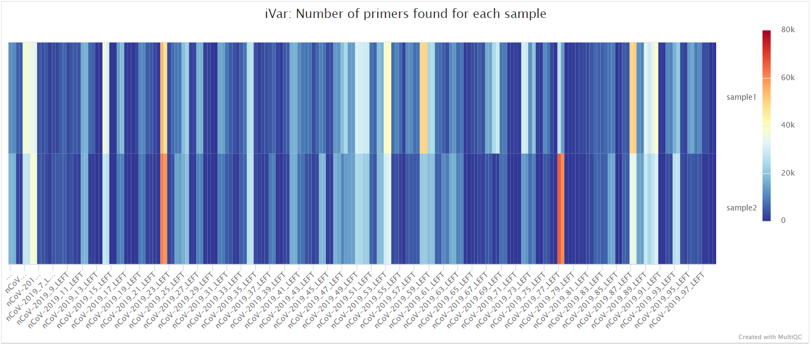
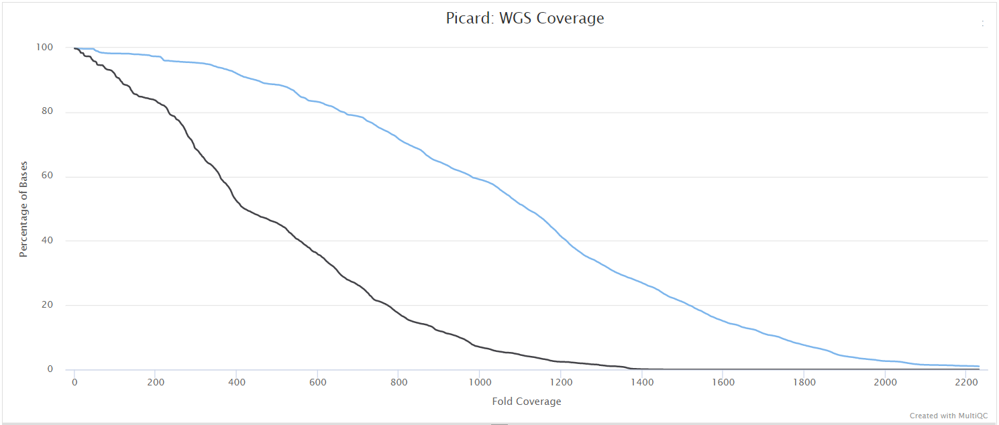

# Introduction

This document describes the output produced by the pipeline. Most of the plots are taken from the MultiQC report, which summarises results at the end of the pipeline.

The directories listed below will be created in the results directory after the pipeline has finished. All paths are relative to the top-level results directory.

# Nanopore: Pipeline overview

* [Preprocessing](#nanopore-preprocessing)
  * [pycoQC](#nanopore-pycoqc) - Sequencing QC
  * [artic guppyplex](#nanopore-artic-guppyplex) - Aggregate pre-demultiplexed reads from MinKNOW/Guppy
  * [NanoPlot](#nanopore-nanoplot) - Read QC
* [Variant calling](#nanopore-variant-calling)
  * [artic minion](#nanopore-artic-minion) - Align reads, call variants and generate consensus sequence
* [Downstream analysis](#nanopore-downstream-analysis)
  * [SAMtools](#nanopore-samtools) - Remove unmapped reads and obtain alignment metrics
  * [mosdepth](#nanopore-mosdepth) - Genome-wide and amplicon coverage QC plots
  * [BCFTools](#nanopore-bcftools) - Variant count metrics
  * [SnpEff and SnpSift](#nanopore-snpeff-and-snpsift) - Genetic variant annotation and functional effect prediction
  * [QUAST](#nanopore-quast) - Consensus assessment report
  * [Pangolin](#nanopore-pangolin) - Lineage analysis
* [Workflow reporting](#nanopore-workflow-reporting)
  * [MultiQC](#nanopore-multiqc) - Present QC, visualisation and custom reporting for sequencing, raw reads, alignment and variant calling results

## Nanopore: Preprocessing

### Nanopore: pycoQC

Output files

* `nanopore/pycoqc/`  
  * `*.html` and `.json` file that includes a run summary and graphical representation of various QC metrics including distribution of read length, distribution of read quality scores, mean read quality per sequence length, output per channel over experiment time and percentage of reads per barcode.  

[PycoQC](https://github.com/a-slide/pycoQC) compute metrics and generate QC plots using the sequencing summary information generated by basecalling/demultiplexing tools such as Guppy e.g. distribution of read length, read length over time, number of reads per barcode and other general stats.

### Nanopore: artic guppyplex

Output files

* `nanopore/guppyplex/`  
  * `*.fastq.gz` files generated by aggregate pre-demultiplexed reads from MinKNOW/Guppy.

> NB: These files are not saved by default to save on storage space but they can be using a simple Nextflow custom config file.

Aggregate pre-demultiplexed reads from MinKNOW/Guppy with [`artic guppyplex`](https://artic.readthedocs.io/en/latest/commands/).

### Nanopore: NanoPlot

Output files

* `nanopore/nanoplot/<SAMPLE>/`  
  * Per-sample `*.html` files for QC metrics and individual `*.png` image files for plots.

[NanoPlot](https://github.com/wdecoster/NanoPlot) it a tool that can be used to produce general quality metrics from various Nanopore-based input files including fastq files e.g. quality score distribution, read lengths and other general stats.

## Nanopore: Variant calling

### Nanopore: artic minion

Output files

* `nanopore/<CALLER>/`
  * `*.consensus.fasta`: Consensus fasta file generated by artic minion.

  * `*.pass.vcf.gz`: VCF file containing variants passing quality filters.
  * `*.pass.vcf.gz.tbi`: VCF index file containing variants passing quality filters.
  * `*.primers.vcf`: VCF file containing variants found in primer-binding regions.
  * `*.merged.vcf`: VCF file containing all detected variants.
  * `*.fail.vcf`: VCF file containing variants failing quality filters.
  * `*.sorted.bam`: BAM file generated by initial alignment.
  * `*.sorted.bam.bai`: BAM index file generated by initial alignment.
  * `*.primertrimmed.rg.sorted.bam`: BAM file generated after primer-binding site trimming.
  * `*.primertrimmed.rg.sorted.bam.bai`: BAM index file generated after primer-binding site trimming.
  * `*.trimmed.rg.sorted.bam`: BAM file without primer-binding site trimming.
  * `*.trimmed.rg.sorted.bam.bai`: BAM index file without primer-binding site trimming.

> **NB:** The value of `<CALLER>` in the output directory name above is determined by the `artic_minion_caller` parameter (Default: 'nanopolish').

Align reads, call variants and generate consensus sequence with [`artic minion`](https://artic.readthedocs.io/en/latest/commands/).

## Nanopore: Downstream analysis

### Nanopore: SAMtools

Output files

* `nanopore/<CALLER>/`
  * `*.mapped.sorted.bam`: Coordinate sorted BAM file containing read alignment information.
  * `*.mapped.sorted.bam.bai`: Index file for coordinate sorted BAM file.
* `nanopore/<CALLER>/samtools_stats/`  
  * SAMtools `*.mapped.sorted.bam.flagstat`, `*.mapped.sorted.bam.idxstats` and `*.mapped.sorted.bam.stats` files generated from the alignment files.

> **NB:** The value of `<CALLER>` in the output directory name above is determined by the `artic_minion_caller` parameter (Default: 'nanopolish').

BAM files are further processed with [SAMtools](http://samtools.sourceforge.net/) to remove unmapped reads as well as to generate read mapping statistics.

### Nanopore: mosdepth

Output files

* `nanopore/<CALLER>/mosdepth/genome/`
  * `all_samples.mosdepth.coverage.tsv`: File aggregating genome-wide coverage values across all samples used for plotting.
  * `*.mosdepth.coverage.pdf`: Whole-genome coverage plot.
  * `*.mosdepth.coverage.tsv`: File containing coverage values for the above plot.
  * `*.mosdepth.summary.txt`: Summary metrics including mean, min and max coverage values.
* `nanopore/<CALLER>/mosdepth/amplicon/`
  * `all_samples.mosdepth.coverage.tsv`: File aggregating per-amplicon coverage values across all samples used for plotting.
  * `all_samples.mosdepth.heatmap.pdf`: Heatmap showing per-amplicon coverage across all samples.
  * `*.mosdepth.coverage.pdf`: Bar plot showing per-amplicon coverage for an individual sample.
  * `*.mosdepth.coverage.tsv`: File containing per-amplicon coverage values for the above plot.
  * `*.mosdepth.summary.txt`: Summary metrics including mean, min and max coverage values.

> **NB:** The value of `<CALLER>` in the output directory name above is determined by the `artic_minion_caller` parameter (Default: 'nanopolish').

[mosdepth](mosdepth) is a fast BAM/CRAM depth calculation for WGS, exome, or targeted sequencing. mosdepth is used in this pipeline to obtain genome-wide coverage values in 200bp windows and for `--protocol amplicon` to obtain amplicon/region-specific coverage metrics. The results are then either rendered in MultiQC (genome-wide coverage) or are plotted using custom `R` scripts.

  

### Nanopore: BCFTools

Output files

* `nanopore/<CALLER>/bcftools_stats/`
  * `*.bcftools_stats.txt`: Statistics and counts obtained from VCF file.

> **NB:** The value of `<CALLER>` in the output directory name above is determined by the `artic_minion_caller` parameter (Default: 'nanopolish').

[BCFtools](http://samtools.github.io/bcftools/bcftools.html) is a set of utilities that manipulate variant calls in [VCF](https://vcftools.github.io/specs.html) and its binary counterpart BCF format. It can also used be used to generate statistics and counts obtained from VCF files as used here.

### Nanopore: SnpEff and SnpSift

Output files

* `nanopore/<CALLER>/snpeff/`
  * `*.snpeff.csv`: Variant annotation csv file.
  * `*.snpeff.genes.txt`: Gene table for annotated variants.
  * `*.snpeff.summary.html`: Summary html file for variants.
  * `*.snpeff.vcf.gz`: VCF file with variant annotations.
  * `*.snpeff.vcf.gz.tbi`: Index for VCF file with variant annotations.
  * `*.snpsift.txt`: SnpSift summary table.
* `nanopore/<CALLER>/snpeff/bcftools_stats/`
  * `*.snpeff.bcftools_stats.txt`: Statistics and counts obtained from SnpEff VCF file.

> **NB:** The value of `<CALLER>` in the output directory name above is determined by the `artic_minion_caller` parameter (Default: 'nanopolish').

[SnpEff](http://snpeff.sourceforge.net/SnpEff.html) is a genetic variant annotation and functional effect prediction toolbox. It annotates and predicts the effects of genetic variants on genes and proteins (such as amino acid changes).

[SnpSift](http://snpeff.sourceforge.net/SnpSift.html) annotates genomic variants using databases, filters, and manipulates genomic annotated variants. After annotation with SnpEff, you can use SnpSift to help filter large genomic datasets in order to find the most significant variants.

### Nanopore: QUAST

Output files

* `nanopore/<CALLER>/quast/`
  * `report.html`: Results report in HTML format. Also available in various other file formats i.e. `report.pdf`, `report.tex`, `report.tsv` and `report.txt`.

> **NB:** The value of `<CALLER>` in the output directory name above is determined by the `artic_minion_caller` parameter (Default: 'nanopolish').

[QUAST](http://bioinf.spbau.ru/quast) is used to generate a single report with which to evaluate the quality of the consensus sequence across all of the samples provided to the pipeline. The HTML results can be opened within any browser (we recommend using Google Chrome). Please see the [QUAST output docs](http://quast.sourceforge.net/docs/manual.html#sec3) for more detailed information regarding the output files.

### Nanopore: Pangolin

Output files

* `nanopore/<CALLER>/pangolin/`
  * `*.pangolin.csv`: Lineage analysis results from Pangolin.

> **NB:** The value of `<CALLER>` in the output directory name above is determined by the `artic_minion_caller` parameter (Default: 'nanopolish').

Lineage analysis with [`Pangolin`](https://github.com/cov-lineages/pangolin)

## Nanopore: Workflow reporting

### Nanopore: MultiQC

Output files

* `multiqc/<CALLER>/`  
  * `multiqc_report.html`: a standalone HTML file that can be viewed in your web browser.
  * `multiqc_data/`: directory containing parsed statistics from the different tools used in the pipeline.

[MultiQC](http://multiqc.info) is a visualization tool that generates a single HTML report summarizing all samples in your project. Most of the pipeline QC results are visualised in the report and further statistics are available in the report data directory.

Results generated by MultiQC collate pipeline QC from pycoQC, samtools flagstat, samtools idxstats, samtools stats, mosdepth, BCFTools, SnpEff and QUAST.

The default [`multiqc config file`](https://github.com/nf-core/viralrecon/blob/master/assets/multiqc_config_nanopore.yaml) has been written in a way in which to structure these QC metrics to make them more interpretable in the final report.

The pipeline has special steps which also allow the software versions to be reported in the MultiQC output for future traceability. For more information about how to use MultiQC reports, see <http://multiqc.info>.

An example MultiQC report generated from a full-sized dataset can be viewed on the [nf-core website](https://nf-co.re/viralrecon/results).

# Illumina: Pipeline overview

Please click [here](https://raw.githack.com/nf-core/viralrecon/master/docs/html/multiqc_report.html) to see an example MultiQC report generated using the parameters defined in [this configuration file](https://github.com/nf-core/viralrecon/blob/master/conf/test_full.config) to run the pipeline on [samples](https://zenodo.org/record/3735111) which were prepared from the [ncov-2019 ARTIC Network V1 amplicon set](https://artic.network/ncov-2019) and sequenced on the Illumina MiSeq platform in 301bp paired-end format.

The pipeline is built using [Nextflow](https://www.nextflow.io/) and processes data using the following steps:

* [Preprocessing](#illumina-preprocessing)
  * [cat](#cat) - Merge re-sequenced FastQ files
  * [FastQC](#fastqc) - Raw read QC
  * [fastp](#fastp) - Adapter and quality trimming
* [Variant calling](#illumina-variant-calling)
  * [Bowtie 2](#bowtie-2) - Read alignment relative to reference genome
  * [SAMtools](#samtools) - Sort, index and generate metrics for alignments
  * [iVar trim](#ivar-trim) - Primer sequence removal for amplicon data
  * [picard MarkDuplicates](#picard-markduplicates) - Duplicate read marking and removal
  * [picard CollectMultipleMetrics](#picard-collectmultiplemetrics) - Whole genome coverage and alignment metrics
  * [mosdepth](#mosdepth) - Whole-genome and amplicon coverage metrics
  * [iVar variants and iVar consensus](#ivar-variants-and-ivar-consensus) *||* [BCFTools and BEDTools](#bcftools-and-bedtools) - Variant calling and consensus sequence generation
    * [SnpEff and SnpSift](#snpeff-and-snpsift) - Genetic variant annotation and functional effect prediction
    * [QUAST](#quast) - Consensus assessment report
  * [BCFTools isec](#bcftools-isec) - Intersect variants across all callers
* [De novo assembly](#illumina-de-novo-assembly)
  * [Cutadapt](#cutadapt) - Primer trimming for amplicon data
  * [Kraken 2](#kraken-2) - Removal of host reads
  * [SPAdes](#spades) *||* [Unicycler](#unicycler) *||* [minia](#minia) - Viral genome assembly
    * [BLAST](#blast) - Blast to reference assembly
    * [ABACAS](#abacas) - Order contigs according to reference genome
    * [PlasmidID](#plasmidid) - Assembly report and visualisation
    * [Assembly QUAST](#assembly-quast) - Assembly quality assessment
    * [Minimap2, seqwish, vg](#minimap2-seqwish-vg) - Call variants from induced genome variation graph
    * [Assembly SnpEff and SnpSift](#assembly-snpeff-and-snpsift) - Genetic variant annotation and functional effect prediction
* [Workflow reporting and genomes](#illumina-workflow-reporting-and-genomes)
  * [MultiQC](#multiqc) - Present QC for raw reads, alignment, assembly and variant calling
  * [Reference genome files](#reference-genome-files) - Save reference genome indices/files

## Illumina: Preprocessing

### parallel-fastq-dump

Output files

* `preprocess/sra/`
  * `sra_run_info.tsv`: Run information file for all samples to be downloaded from the ENA/SRA.
  * `*.fastq.gz`: Paired-end/single-end reads downloaded and extracted from the ENA/SRA.
* `preprocess/sra/md5/`
  * `*.md5`: Files containing `md5` sum for FastQ files downloaded from ENA/SRA.
* `preprocess/sra/log/`
  * `*.fastq_dump.log`: Log file generated from stdout whilst running `parallel-fastq-dump`.

> **NB:** Downloaded FastQ files will only be saved in the results directory if the `--save_sra_fastq` parameter is supplied.  

Please see the [usage docs](https://github.com/nf-core/viralrecon/blob/master/docs/usage.md#supported-public-repository-ids) for a list of supported public repository identifiers and how to provide them to the pipeline. The final sample information for all identifiers is obtained from the ENA which provides direct download links for FastQ files as well as their associated md5sums. If a download link exists, the files will be downloaded by FTP otherwise they will be downloaded using [parallel-fastq-dump](https://github.com/rvalieris/parallel-fastq-dump).

### cat

If multiple libraries/runs have been provided for the same sample in the input samplesheet (e.g. to increase sequencing depth) then these will be merged at the very beginning of the pipeline in order to have consistent sample naming throughout the pipeline. Please refer to the [usage docs](https://github.com/nf-core/viralrecon/blob/dev/docs/usage.md#format) to see how to specify these samples in the input samplesheet.

### FastQC

Output files

* `preprocess/fastqc/`
  * `*_fastqc.html`: FastQC report containing quality metrics.
* `preprocess/fastqc/zips/`
  * `*_fastqc.zip`: Zip archive containing the FastQC report, tab-delimited data file and plot images.

> **NB:** The FastQC plots in this directory are generated relative to the raw, input reads. They may contain adapter sequence and regions of low quality. To see how your reads look after trimming please refer to the FastQC reports in the `preprocess/fastp/fastqc/` directory.

[FastQC](http://www.bioinformatics.babraham.ac.uk/projects/fastqc/) gives general quality metrics about your sequenced reads. It provides information about the quality score distribution across your reads, per base sequence content (%A/T/G/C), adapter contamination and overrepresented sequences. For further reading and documentation see the [FastQC help pages](http://www.bioinformatics.babraham.ac.uk/projects/fastqc/Help/).

### fastp

Output files

* `preprocess/fastp/`
  * `*.fastp.html`: Trimming report in html format.
  * `*.fastp.json`: Trimming report in json format.
  * `*.trim.fastq.gz`: Paired-end/single-end trimmed reads.
  * `*.trim.fail.gz`: Unpaired trimmed reads (only for paired-end data).  
* `preprocess/fastp/log/`
  * `*.fastp.log`: Trimming log file.
* `preprocess/fastp/fastqc/`:
  * `*.trim_fastqc.html`: FastQC report of the trimmed reads.
* `preprocess/fastp/fastqc/zips/`
  * `*.trim_fastqc.zip`: Zip archive containing the FastQC report.

[fastp](https://github.com/OpenGene/fastp) is a tool designed to provide fast, all-in-one preprocessing for FastQ files. It has been developed in C++ with multithreading support to achieve higher performance. fastp is used in this pipeline for standard adapter trimming and quality filtering.

## Illumina: Variant calling

A file called `summary_variants_metrics_mqc.tsv` containing a selection of read and variant calling metrics will be saved in the `variants/` results directory. The same metrics have also been added to the top of the MultiQC report.

### Bowtie 2

Output files

* `variants/bam/`
  * `<SAMPLE>.bam`: Original BAM file created by Bowtie 2.
* `variants/bam/log/`
  * `<SAMPLE>.bowtie2.log`: Bowtie 2 mapping log file.

[Bowtie 2](http://bio-bwa.sourceforge.net/) is an ultrafast and memory-efficient tool for aligning sequencing reads to long reference sequences. Bowtie 2 supports gapped, local, and paired-end alignment modes.

### SAMtools

Output files

* `variants/bam/`
  * `<SAMPLE>.sorted.bam`: Coordinate sorted BAM file containing read alignment information.
  * `<SAMPLE>.sorted.bam.bai`: Index file for coordinate sorted BAM file.
* `variants/bam/samtools_stats/`
  * SAMtools `<SAMPLE>.sorted.bam.flagstat`, `<SAMPLE>.sorted.bam.idxstats` and `<SAMPLE>.sorted.bam.stats` files generated from the alignment files.

Bowtie 2 BAM files are further processed with [SAMtools](http://samtools.sourceforge.net/) to sort them by coordinate, for indexing, as well as to generate read mapping statistics.

### iVar trim

Output files

* `variants/bam/`
  * `<SAMPLE>.trim.sorted.bam`: Coordinate sorted BAM file after primer trimming.
  * `<SAMPLE>.trim.sorted.bam.bai`: Index file for coordinate sorted BAM file after primer trimming.
* `variants/bam/samtools_stats/`
  * SAMtools `<SAMPLE>.trim.flagstat`, `<SAMPLE>.trim.idxstats` and `<SAMPLE>.trim.stats` files generated from the primer trimmed alignment files.
* `variants/bam/log/`
  * `<SAMPLE>.trim.ivar.log`: iVar trim log file obtained from stdout.

If the `--protocol amplicon` parameter is provided then [iVar](http://gensoft.pasteur.fr/docs/ivar/1.0/manualpage.html) is used to trim amplicon primer sequences from the aligned reads. iVar uses the primer positions supplied in `--primer_bed` to soft clip primer sequences from a coordinate sorted BAM file.

### picard MarkDuplicates

Output files

* `variants/bam/`
  * `<SAMPLE>.<SUFFIX>.sorted.bam`: Coordinate sorted BAM file after duplicate marking.
  * `<SAMPLE>.<SUFFIX>.sorted.bam.bai`: Index file for coordinate sorted BAM file after duplicate marking.
* `variants/bam/samtools_stats/`
  * SAMtools `<SAMPLE>.<SUFFIX>.flagstat`, `<SAMPLE>.<SUFFIX>.idxstats` and `<SAMPLE>.<SUFFIX>.stats` files generated from the duplicate marked alignment files.
* `variants/bam/picard_metrics/`
  * `<SAMPLE>.<SUFFIX>.MarkDuplicates.metrics.txt`: Metrics file from MarkDuplicates.

> **NB:** The value of `<SUFFIX>` in the output file names above will depend on the preceeding steps that were run in the pipeline. If `--protocol amplicon` is specified then this process will be run on the iVar trimmed alignments and the value of `<SUFFIX>` will be `trim.mkD`. However, if `--protocol metagenomic` is specified then the process will be run on the alignments obtained directly from Bowtie 2 and the value of `<SUFFIX>` will be `mkD`; where `mkD` is an abbreviation for MarkDuplicates.

Unless you are using [UMIs](https://emea.illumina.com/science/sequencing-method-explorer/kits-and-arrays/umi.html) it is not possible to establish whether the fragments you have sequenced from your sample were derived via true biological duplication (i.e. sequencing independent template fragments) or as a result of PCR biases introduced during the library preparation. By default, the pipeline uses picard MarkDuplicates to *mark* the duplicate reads identified amongst the alignments to allow you to guage the overall level of duplication in your samples. However, you can also choose to remove any reads identified as duplicates via the `--filter_dups` parameter.

### picard CollectMultipleMetrics

Output files

* `variants/bam/picard_metrics/`  
  * `<SAMPLE>.<SUFFIX>.CollectMultipleMetrics.*`: Alignment QC files from picard CollectMultipleMetrics in `*_metrics` textual format and plotted in `*.pdf` format.
  * `<SAMPLE>.<SUFFIX>.CollectWgsMetrics.coverage_metrics`: Coverage metrics file from CollectWgsMetrics.

> **NB:** The value of `<SUFFIX>` in the output file names above will depend on the preceeding steps that were run in the pipeline. If `--protocol amplicon` is specified then this process will be run on the iVar trimmed alignments and the value of `<SUFFIX>` will be `trim.mkD`. However, if `--protocol metagenomic` is specified then the process will be run on the alignments obtained directly from Bowtie 2 and the value of `<SUFFIX>` will be `mkD`; where `mkD` is an abbreviation for MarkDuplicates.

[picard-tools](https://broadinstitute.github.io/picard/command-line-overview.html) is a set of command-line tools for manipulating high-throughput sequencing data. We use picard-tools in this pipeline to obtain mapping and coverage metrics.

### mosdepth

Output files

* `variants/bam/mosdepth/genome/`
  * `<SAMPLE>.<SUFFIX>.genome.mosdepth.global.dist.txt`: A distribution of proportion of bases covered at or above a given threshold for each chromosome and genome-wide.
  * `<SAMPLE>.<SUFFIX>.genome.mosdepth.region.dist.txt`: A distribution of proportion of bases covered at or above a given threshold for each chromosome and genome-wide.
  * `<SAMPLE>.<SUFFIX>.genome.mosdepth.summary.txt`: Summary metrics including mean, min and max coverage values.
  * `<SAMPLE>.<SUFFIX>.genome.per-base.bed.gz`: Per-base depth output genome-wide.
  * `<SAMPLE>.<SUFFIX>.genome.per-base.bed.gz.csi`: CSI index that can be used for tabix queries from above file.
  * `<SAMPLE>.<SUFFIX>.genome.regions.bed.gz`: Mean regional depth for 200bp windows genome-wide.
  * `<SAMPLE>.<SUFFIX>.genome.regions.bed.gz.csi`: CSI index that can be used for tabix queries from above file.
* `variants/bam/mosdepth/genome/plots/`
  * `all_samples.<SUFFIX>.genome.regions.coverage.tsv`: File aggregating genome-wide coverage values across all samples used for plotting.
  * `<SAMPLE>.<SUFFIX>.genome.regions.coverage.pdf`: Whole-genome coverage plot.
  * `<SAMPLE>.<SUFFIX>.genome.regions.coverage.tsv`: File containing coverage values for the above plot.
* `variants/bam/mosdepth/amplicon/`
  * `<SAMPLE>.<SUFFIX>.amplicon.mosdepth.global.dist.txt`: A distribution of proportion of bases covered at or above a given threshold for each chromosome and genome-wide.
  * `<SAMPLE>.<SUFFIX>.amplicon.mosdepth.region.dist.txt`: A distribution of proportion of bases covered at or above a given threshold for each chromosome and genome-wide.
  * `<SAMPLE>.<SUFFIX>.amplicon.mosdepth.summary.txt`: Summary metrics including mean, min and max coverage values.
  * `<SAMPLE>.<SUFFIX>.amplicon.per-base.bed.gz`: Per-base depth output genome-wide.
  * `<SAMPLE>.<SUFFIX>.amplicon.per-base.bed.gz.csi`: CSI index that can be used for tabix queries from above file.
  * `<SAMPLE>.<SUFFIX>.amplicon.regions.bed.gz`: Mean regional depth for individual amplicons genome-wide.
  * `<SAMPLE>.<SUFFIX>.amplicon.regions.bed.gz.csi`: CSI index that can be used for tabix queries from above file.
  * `<SAMPLE>.<SUFFIX>.amplicon.thresholds.bed.gz`: Threshold output to indicate how many bases in each region are covered at given thresholds.
  * `<SAMPLE>.<SUFFIX>.amplicon.thresholds.bed.gz.csi`: CSI index that can be used for tabix queries from above file.
* `variants/bam/mosdepth/amplicon/plots/`
  * `all_samples.<SUFFIX>.amplicon.regions.coverage.tsv`: File aggregating per-amplicon coverage values across all samples used for plotting.
  * `all_samples.<SUFFIX>.amplicon.regions.heatmap.pdf`: Heatmap showing per-amplicon coverage across all samples.
  * `<SAMPLE>.<SUFFIX>.amplicon.regions.coverage.pdf`: Bar plot showing per-amplicon coverage for an individual sample.
  * `<SAMPLE>.<SUFFIX>.amplicon.regions.coverage.tsv`: File containing per-amplicon coverage values for the above plot.

> NB: The value of `<SUFFIX>` in the output file names above will depend on the preceeding steps that were run in the pipeline. If `--protocol amplicon` is specified then this process will be run on the iVar trimmed alignments and the value of `<SUFFIX>` will be `trim.mkD`. However, if `--protocol metagenomic` is specified then the process will be run on the alignments obtained directly from Bowtie 2 and the value of `<SUFFIX>` will be `mkD`; where `mkD` is an abbreviation for MarkDuplicates.

[mosdepth](mosdepth) is a fast BAM/CRAM depth calculation for WGS, exome, or targeted sequencing. mosdepth is used in this pipeline to obtain genome-wide coverage values in 200bp windows and for `--protocol amplicon` to obtain amplicon/region-specific coverage metrics. The results are then either rendered in MultiQC (genome-wide coverage) or are plotted using custom `R` scripts.

  

### iVar variants and iVar consensus

Output files

* `variants/ivar/`
  * `<SAMPLE>.tsv`: Low frequency variants in TSV format.
  * `<SAMPLE>.vcf.gz`: Low frequency variants VCF file.
  * `<SAMPLE>.vcf.gz.tbi`: Low frequency variants VCF index file.
  * `<SAMPLE>.vcf.gz`: High frequency variants VCF file.
  * `<SAMPLE>.vcf.gz.tbi`: High frequency variants VCF index file.
* `variants/ivar/consensus/`
  * `<SAMPLE>.consensus.fa`: Consensus Fasta file generated by iVar.
  * `<SAMPLE>.consensus.qual.txt`: File with the average quality of each base in the consensus sequence.
* `variants/ivar/consensus/base_qc/`
  * `<SAMPLE>.ACTG_density.pdf`: Plot showing density of ACGT bases within the consensus sequence.
  * `<SAMPLE>.base_counts.pdf`: Plot showing frequency and percentages of all bases in consensus sequence.
  * `<SAMPLE>.base_counts.tsv`: File containing frequency and percentages of all bases in consensus sequence.
  * `<SAMPLE>.N_density.pdf`: Plot showing density of N bases within the consensus sequence.
  * `<SAMPLE>.N_run.tsv`: File containing start positions and width of N bases in consensus sequence.
* `variants/ivar/log/`
  * `<SAMPLE>.variant.counts.log`: Variant counts for low frequency variants.
  * `<SAMPLE>.variant.counts.log`: Variant counts for high frequency variants.
* `variants/ivar/bcftools_stats/`
  * `<SAMPLE>.bcftools_stats.txt`: Statistics and counts obtained from low frequency variants VCF file.
  * `<SAMPLE>.bcftools_stats.txt`: Statistics and counts obtained from high frequency variants VCF file.

[iVar](https://github.com/andersen-lab/ivar/blob/master/docs/MANUAL.md) is a computational package that contains functions broadly useful for viral amplicon-based sequencing. We use iVar in this pipeline to [trim primer sequences](#ivar-trim) for amplicon input data as well as to call variants and for consensus sequence generation.

### BCFTools and BEDTools

Output files

* `variants/bcftools/`
  * `<SAMPLE>.vcf.gz`: Variants VCF file.
  * `<SAMPLE>.vcf.gz.tbi`: Variants VCF index file.
* `variants/bcftools/consensus/`
  * `<SAMPLE>.consensus.fa`: Consensus Fasta file generated by integrating the variants called by BCFTools into the reference genome.
  * `<SAMPLE>.consensus.masked.fa`: Masked consensus Fasta file.
* `variants/bcftools/consensus/base_qc/`
  * `<SAMPLE>.ACTG_density.pdf`: Plot showing density of ACGT bases within the consensus sequence.
  * `<SAMPLE>.base_counts.pdf`: Plot showing frequency and percentages of all bases in consensus sequence.
  * `<SAMPLE>.base_counts.tsv`: File containing frequency and percentages of all bases in consensus sequence.
  * `<SAMPLE>.N_density.pdf`: Plot showing density of N bases within the consensus sequence.
  * `<SAMPLE>.N_run.tsv`: File containing start positions and width of N bases in consensus sequence.
* `variants/bcftools/bcftools_stats/`
  * `<SAMPLE>.bcftools_stats.txt`: Statistics and counts obtained from VCF file.

[BCFtools](http://samtools.github.io/bcftools/bcftools.html) can be used to call variants directly from BAM alignment files. The functionality to call variants with BCFTools in this pipeline was inspired by work carried out by [Conor Walker](https://github.com/conorwalker/covid19/blob/3cb26ec399417bedb7e60487415c78a405f517d6/scripts/call_variants.sh). In contrast to iVar, the original variant calls obtained by BCFTools are not filtered further by a higher allele frequency. It seems that the default calls obtained by BCFTools appear to be comparable with the high frequency variants generated by iVar.

[BCFtools](http://samtools.github.io/bcftools/bcftools.html) is a set of utilities that manipulate variant calls in [VCF](https://vcftools.github.io/specs.html) and its binary counterpart BCF format. BCFTools is used in the variant calling and *de novo* assembly steps of this pipeline to obtain basic statistics from the VCF output. It can also used be used to generate a consensus sequence by integrating variant calls into the reference genome.

[BEDTools](https://bedtools.readthedocs.io/en/latest/) is a swiss-army knife of tools for a wide-range of genomics analysis tasks. In this pipeline we use `bedtools genomecov` to compute the per-base mapped read coverage in bedGraph format, and `bedtools maskfasta` to mask sequences in a Fasta file based on intervals defined in a feature file. This may be useful for creating your own masked genome file based on custom annotations or for masking all but your target regions when aligning sequence data from a targeted capture experiment.

### SnpEff and SnpSift

Output files

* `variants/<CALLER>/snpeff/`
  * `*.snpEff.csv`: Variant annotation csv file.
  * `*.snpEff.genes.txt`: Gene table for annotated variants.
  * `*.snpEff.summary.html`: Summary html file for variants.
  * `*.snpEff.vcf.gz`: VCF file with variant annotations.
  * `*.snpEff.vcf.gz.tbi`: Index for VCF file with variant annotations.
  * `*.snpSift.table.txt`: SnpSift summary table.

> **NB:** The value of `<CALLER>` in the output directory name above is determined by the `--callers` parameter (Default: 'ivar').

[SnpEff](http://snpeff.sourceforge.net/SnpEff.html) is a genetic variant annotation and functional effect prediction toolbox. It annotates and predicts the effects of genetic variants on genes and proteins (such as amino acid changes).

[SnpSift](http://snpeff.sourceforge.net/SnpSift.html) annotates genomic variants using databases, filters, and manipulates genomic annotated variants. After annotation with SnpEff, you can use SnpSift to help filter large genomic datasets in order to find the most significant variants.

### QUAST

Output files

* `variants/<CALLER>/quast/`
  * `report.html`: Results report in HTML format. Also available in various other file formats i.e. `report.pdf`, `report.tex`, `report.tsv` and `report.txt`.

> **NB:** The value of `<CALLER>` in the output directory name above is determined by the `--callers` parameter (Default: 'ivar').

[QUAST](http://bioinf.spbau.ru/quast) is used to generate a single report with which to evaluate the quality of the consensus sequence across all of the samples provided to the pipeline. The HTML results can be opened within any browser (we recommend using Google Chrome). Please see the [QUAST output docs](http://quast.sourceforge.net/docs/manual.html#sec3) for more detailed information regarding the output files.

### BCFTools isec

Output files

* `variants/intersect/<SAMPLE>/`
  * `*.vcf.gz`: VCF file containing variants common to at least 2/3 callers. There will be one file for each caller - see `README.txt` for details.
  * `*.vcf.gz.tbi`: Index for VCF file.
  * `README.txt`: File containing command used and file name mappings.
  * `sites.txt`: List of variants common to at least 2/3 callers in textual format. The last column indicates presence (1) or absence (0) amongst the 3 different callers.

> **NB:** This process will only be executed when all 3 variant callers are specified to run, as is by default i.e. `--callers ivar`.

[BCFTools isec](http://samtools.github.io/bcftools/bcftools.html#isec) can be used to intersect the variant calls generated by the 3 different callers used in the pipeline. This permits a quick assessment of how consistently a particular variant is being called using different algorithms and to prioritise the investigation of the variants.

## Illumina: De novo assembly

A file called `summary_assembly_metrics_mqc.tsv` containing a selection of read and *de novo* assembly related metrics will be saved in the `assembly/` results directory. The same metrics have also been added to the top of the MultiQC report.

### Cutadapt

Output files

* `assembly/cutadapt/`
  * `*.ptrim.fastq.gz`: FastQ files after primer sequence trimming.
* `assembly/cutadapt/log/`
  * `*.cutadapt.log`: Cutadapt log file generated from stdout.
* `assembly/cutadapt/fastqc/`
  * `*.ptrim_fastqc.html`: FastQC report of the trimmed reads.
* `assembly/cutadapt/fastqc/zips/`
  * `*.ptrim_fastqc.zip`: Zip archive containing the FastQC report.

In the variant calling branch of the pipeline we are using [iVar trim](#ivar-trim) to remove primer sequences from the aligned BAM files for amplicon data. Since in the *de novo* assembly branch we don't align the reads, we use [Cutadapt](https://cutadapt.readthedocs.io/en/stable/guide.html) as an alternative option to remove and clean the primer sequences directly from FastQ files.

### Kraken 2

Output files

* `assembly/kraken2/`
  * `*.host*.fastq.gz`: Reads that were classified to the host database.
  * `*.viral*.fastq.gz`: Reads that were unclassified to the host database.
  * `*.kraken2.report.txt`: Kraken 2 taxonomic report. See [here](https://ccb.jhu.edu/software/kraken2/index.shtml?t=manual#sample-report-output-format) for a detailed description of the format.

[Kraken 2](https://ccb.jhu.edu/software/kraken2/index.shtml?t=manual) is a sequence classifier that assigns taxonomic labels to DNA sequences. Kraken 2 examines the k-mers within a query sequence and uses the information within those k-mers to query a database. That database maps k-mers to the lowest common ancestor (LCA) of all genomes known to contain a given k-mer.

We used a Kraken 2 database in this workflow to filter out reads specific to the host genome. The remainder of the reads are then passed to numerous *de novo* assembly algorithms in order to reconstruct the viral genome.

### SPAdes

Output files

* `assembly/spades/`
  * `*.scaffolds.fa`: SPAdes scaffold assembly.
  * `*.assembly.gfa`: SPAdes assembly graph in [GFA](https://github.com/GFA-spec/GFA-spec/blob/master/GFA1.md) format.
* `assembly/spades/bandage/`
  * `*.png`: Bandage visualisation for SPAdes assembly graph in PNG format.
  * `*.svg`: Bandage visualisation for SPAdes assembly graph in SVG format.

[SPAdes](http://cab.spbu.ru/software/spades/) is an assembly toolkit containing various assembly pipelines. Generically speaking, SPAdes is one of the most popular de Bruijn graph-based assembly algorithms used for bacterial/viral genome reconstruction.

[Bandage](https://rrwick.github.io/Bandage/) is a program for visualising *de novo* assembly graphs. By displaying connections which are not present in the contigs file, Bandage opens up new possibilities for analysing *de novo* assemblies.

### Unicycler

Output files

* `assembly/unicycler/`
  * `*.scaffolds.fa`: Unicycler scaffold assembly.
  * `*.assembly.gfa`: Unicycler assembly graph in GFA format.
* `assembly/unicycler/bandage/`
  * `*.png`: Bandage visualisation for Unicycler assembly graph in PNG format.
  * `*.svg`: Bandage visualisation for Unicycler assembly graph in SVG format.

[Unicycler](https://github.com/rrwick/Unicycler) is an assembly pipeline for bacterial genomes. It can assemble Illumina-only read sets where it functions as a SPAdes-optimiser.

### minia

Output files

* `assembly/minia/<MINIA_KMER>/`
  * `*.scaffolds.fa`: Minia scaffold assembly.

> **NB:** The value of `<MINIA_KMER>` in the output directory name above is determined by the `--minia_kmer` parameter (Default: 31).

[Minia](https://github.com/GATB/minia) is a short-read assembler based on a de Bruijn graph, capable of assembling a human genome on a desktop computer in a day. The output of Minia is a set of contigs. Minia produces results of similar contiguity and accuracy to other de Bruijn assemblers.

### BLAST

Output files

* `assembly/<ASSEMBLER>/blast/`
  * `*.blast.txt`: BLAST results against the target virus.
  * `*.blast.filt.header.txt`: Filtered BLAST results.

> **NB:** The value of `<ASSEMBLER>` in the output directory name above is determined by the `--assemblers` parameter (Default: 'spades,unicycler,minia').

[blastn](https://blast.ncbi.nlm.nih.gov/Blast.cgi?PAGE_TYPE=BlastSearch) is used to align the assembled contigs against the virus reference genome.

### ABACAS

Output files

* `assembly/<ASSEMBLER>/abacas/`
  * `*.abacas.bin`: Bin file that contains contigs that are not used in ordering.
  * `*.abacas.crunch`: Comparison file.
  * `*.abacas.fasta`: Ordered and orientated sequence file.
  * `*.abacas.gaps`: Gap information.
  * `*.abacas.gaps.tab`: Gap information in tab-delimited format.
  * `*.abacas.MULTIFASTA.fa`: A list of ordered and orientated contigs in a multi-fasta format.
  * `*.abacas.tab`: Feature file
  * `*.unused_contigs.out`: Information on contigs that have a mapping information but could not be used in the ordering.
* `assembly/<ASSEMBLER>/abacas/nucmer/`: Folder containing the files generated by the NUCmer algorithm used by ABACAS.

> **NB:** The value of `<ASSEMBLER>` in the output directory name above is determined by the `--assemblers` parameter (Default: 'spades,unicycler,minia').

[ABACAS](https://www.sanger.ac.uk/science/tools/pagit) was developed to rapidly contiguate (align, order, orientate), visualize and design primers to close gaps on shotgun assembled contigs based on a reference sequence.

### PlasmidID

Output files

* `assembly/<ASSEMBLER>/plasmidid/<SAMPLE>/`
  * `images/<SAMPLE>_<REF_NAME>.png`: PNG file with the visualization of the alignment between the viral assembly and the reference viral genome.
  * `data/`: Files used for drawing the circos images.
  * `database/`: Annotation files used for drawing the circos images.
  * `fasta_files`: Folder with fasta files that correspond to the selection of contigs/scaffolds required to reconstruct the reference genome generated in the `images/` folder.
  * `log/`: Log files.

> **NB:** The value of `<ASSEMBLER>` in the output directory name above is determined by the `--assemblers` parameter (Default: 'spades,unicycler,minia').

[PlasmidID](https://github.com/BU-ISCIII/plasmidID) was used to graphically represent the alignment of the reference genome relative to a given assembly. This helps to visualize the coverage of the reference genome in the assembly. To find more information about the output files refer to the [documentation](https://github.com/BU-ISCIII/plasmidID/wiki/Understanding-the-image:-track-by-track).

### Assembly QUAST

Output files

* `assembly/<ASSEMBLER>/quast/`
  * `report.html`: Results report in HTML format. Also available in various other file formats i.e. `report.pdf`, `report.tex`, `report.tsv` and `report.txt`.

> **NB:** The value of `<ASSEMBLER>` in the output directory name above is determined by the `--assemblers` parameter (Default: 'spades,unicycler,minia').

[QUAST](http://bioinf.spbau.ru/quast) is used to generate a single report with which to evaluate the quality of the *de novo* assemblies across all of the samples provided to the pipeline. The HTML results can be opened within any browser (we recommend using Google Chrome). Please see the [QUAST output docs](http://quast.sourceforge.net/docs/manual.html#sec3) for more detailed information regarding the output files.

### Minimap2, seqwish, vg

Output files

* `assembly/<ASSEMBLER>/variants/`
  * `*.gfa`: Induced genome variation graph.
  * `*.vcf.gz`: VCF file with variant annotations.
  * `*.vcf.gz.tbi`: Index for VCF file with variant annotations.
* `assembly/<ASSEMBLER>/variants/bcftools_stats/`
  * `*.bcftools_stats.txt`: Statistics and counts for variants in VCF files.
* `assembly/<ASSEMBLER>/bandage/`
  * `*.png`: Bandage visualisation for induced genome variation graph in PNG format.
  * `*.svg`: Bandage visualisation for induced genome variation graph in SVG format.

> **NB:** The value of `<ASSEMBLER>` in the output directory name above is determined by the `--assemblers` parameter (Default: 'spades,unicycler,minia').

[Minimap2](https://github.com/lh3/minimap2) is a versatile sequence alignment program that aligns DNA or mRNA sequences against a large reference database. Minimap2 was used to generate all-versus-all alignments between scaffold assembly contigs and the reference genome.

[seqwish](https://github.com/ekg/seqwish) implements a lossless conversion from pairwise alignments between sequences to a variation graph encoding the sequences and their alignments. seqwish was used to induce a genome variation graph from the all-versus-all alignment generated by Minimap2.

[vg](https://github.com/vgteam/vg) is a collection of tools for working with genome variation graphs. vg was used to call variants from the genome variation graph generated by seqwish.

[Bandage](https://github.com/rrwick/Bandage), a Bioinformatics Application for Navigating De novo Assembly Graphs Easily, is a GUI program that allows users to interact with the assembly graphs made by de novo assemblers and other graphs in GFA format. Bandage was used to render induced genome variation graphs as static PNG and SVG images.

### Assembly SnpEff and SnpSift

Output files

* `assembly/<ASSEMBLER>/variants/snpeff/`
  * `*.snpEff.csv`: Variant annotation csv file.
  * `*.snpEff.genes.txt`: Gene table for annotated variants.
  * `*.snpEff.summary.html`: Summary html file for variants.
  * `*.snpEff.vcf.gz`: VCF file with variant annotations.
  * `*.snpEff.vcf.gz.tbi`: Index for VCF file with variant annotations.
  * `*.snpSift.table.txt`: SnpSift summary table.

> **NB:** The value of `<ASSEMBLER>` in the output directory name above is determined by the `--assemblers` parameter (Default: 'spades,unicycler,minia').

[SnpEff](http://snpeff.sourceforge.net/SnpEff.html) is a genetic variant annotation and functional effect prediction toolbox. It annotates and predicts the effects of genetic variants on genes and proteins (such as amino acid changes).

[SnpSift](http://snpeff.sourceforge.net/SnpSift.html) annotates genomic variants using databases, filters, and manipulates genomic annotated variants. After annotation with SnpEff, you can use SnpSift to help filter large genomic datasets in order to find the most significant variants.

## Illumina: Workflow reporting and genomes

### MultiQC

Output files

* `multiqc/`  
  * `multiqc_report.html`: a standalone HTML file that can be viewed in your web browser.
  * `multiqc_data/`: directory containing parsed statistics from the different tools used in the pipeline.
  * `multiqc_plots/`: directory containing static images from the report in various formats.

[MultiQC](http://multiqc.info) is a visualization tool that generates a single HTML report summarizing all samples in your project. Most of the pipeline QC results are visualised in the report and further statistics are available in the report data directory.

Results generated by MultiQC collate pipeline QC from FastQC, fastp, Cutadapt, Bowtie 2, Kraken 2, iVar, samtools flagstat, samtools idxstats, samtools stats, picard CollectMultipleMetrics and CollectWgsMetrics, BCFTools, SnpEff and QUAST.

The default [`multiqc config file`](https://github.com/nf-core/viralrecon/blob/master/assets/multiqc_config.yaml) has been written in a way in which to structure these QC metrics to make them more interpretable in the final report.

The pipeline has special steps which also allow the software versions to be reported in the MultiQC output for future traceability. For more information about how to use MultiQC reports, see <http://multiqc.info>.

Please click [here](https://raw.githack.com/nf-core/viralrecon/master/docs/html/multiqc_report.html) to see an example MultiQC report generated using the parameters defined in [this configuration file](https://github.com/nf-core/viralrecon/blob/master/conf/test_full.config) to run the pipeline on [samples](https://zenodo.org/record/3735111) which were prepared from the [ncov-2019 ARTIC Network V1 amplicon set](https://artic.network/ncov-2019) and sequenced on the Illumina MiSeq platform in 301bp paired-end format.

### Reference genome files

Output files

* `genome/`  
  * `BlastDB/`: BLAST database for viral genome.
  * `Bowtie2Index/`: Bowtie 2 index for viral genome.
  * `kraken2_<KRAKEN2_DB_NAME>/`: Kraken 2 database for host genome.
  * `SnpEffDB/`: SnpEff database for viral genome.
  * `snpeff.config`: SnpEff config file for viral genome.
  * Unzipped genome fasta file for viral genome
  * Unzipped genome annotation GFF file for viral genome

A number of genome-specific files are generated by the pipeline because they are required for the downstream processing of the results. If the `--save_reference` parameter is provided then the Bowtie 2 alignment indices, BLAST and Kraken 2 databases downloaded/generated by the pipeline will be saved in the `genome/` directory. It is recommended to use the `--save_reference` parameter if you are using the pipeline to build a Kraken 2 database for the host genome. This can be quite a time-consuming process and it permits their reuse for future runs of the pipeline or for other purposes.

# Pipeline information

Output files

* `pipeline_info/`
  * Reports generated by Nextflow: `execution_report.html`, `execution_timeline.html`, `execution_trace.txt` and `pipeline_dag.dot`/`pipeline_dag.svg`.
  * Reports generated by the pipeline: `pipeline_report.html`, `pipeline_report.txt` and `software_versions.csv`.
  * Reformatted samplesheet files used as input to the pipeline: `samplesheet.valid.csv`.
  * Documentation for interpretation of results in HTML format: `results_description.html`.

[Nextflow](https://www.nextflow.io/docs/latest/tracing.html) provides excellent functionality for generating various reports relevant to the running and execution of the pipeline. This will allow you to troubleshoot errors with the running of the pipeline, and also provide you with other information such as launch commands, run times and resource usage.
