# Introduction

This document describes the output produced by the pipeline. Most of the plots are taken from the MultiQC report, which summarises results at the end of the pipeline.

The directories listed below will be created in the results directory after the pipeline has finished. All paths are relative to the top-level results directory.

# Nanopore: Pipeline overview

- [Preprocessing](#nanopore-preprocessing)
  - [pycoQC](#nanopore-pycoqc) - Sequencing QC
  - [artic guppyplex](#nanopore-artic-guppyplex) - Aggregate pre-demultiplexed reads from MinKNOW/Guppy
  - [NanoPlot](#nanopore-nanoplot) - Read QC
- [Variant calling](#nanopore-variant-calling)
  - [artic minion](#nanopore-artic-minion) - Align reads, call variants and generate consensus sequence
- [Downstream analysis](#nanopore-downstream-analysis)
  - [SAMtools](#nanopore-samtools) - Remove unmapped reads and obtain alignment metrics
  - [mosdepth](#nanopore-mosdepth) - Genome-wide and amplicon coverage QC plots
  - [BCFTools](#nanopore-bcftools) - Variant count metrics
  - [SnpEff and SnpSift](#nanopore-snpeff-and-snpsift) - Genetic variant annotation and functional effect prediction
  - [QUAST](#nanopore-quast) - Consensus assessment report
  - [Pangolin](#nanopore-pangolin) - Lineage analysis
  - [Nextclade](#nanopore-nextclade) - Clade assignment, mutation calling and sequence quality checks
  - [ASCIIGenome](#nanopore-asciigenome) - Individual variant screenshots with annotation tracks
  - [Variants long table](#nanopore-variants-long-table) - Collate per-sample information for individual variants, functional effect prediction and lineage analysis
- [Workflow reporting](#nanopore-workflow-reporting)
  - [MultiQC](#nanopore-multiqc) - Present QC, visualisation and custom reporting for sequencing, raw reads, alignment and variant calling results

## Nanopore: Preprocessing

A file called `summary_variants_metrics_mqc.csv` containing a selection of read alignment and variant calling metrics will be saved in the `multiqc/<CALLER>/` output directory which is determined by the `--artic_minion_caller` parameter (Default: `nanopolish/`). The same metrics will also be added to the top of the MultiQC report.

### Nanopore: pycoQC

<details markdown="1">
<summary>Output files</summary>

- `pycoqc/`
  - `*.html` and `.json` file that includes a run summary and graphical representation of various QC metrics including distribution of read length, distribution of read quality scores, mean read quality per sequence length, output per channel over experiment time and percentage of reads per barcode.

</details>

[PycoQC](https://github.com/a-slide/pycoQC) compute metrics and generate QC plots using the sequencing summary information generated by basecalling/demultiplexing tools such as Guppy e.g. distribution of read length, read length over time, number of reads per barcode and other general stats.

<p align="center"></p>

### Nanopore: artic guppyplex

<details markdown="1">
<summary>Output files</summary>

- `guppyplex/`
  - `*.fastq.gz` files generated by aggregate pre-demultiplexed reads from MinKNOW/Guppy. These files are not saved by default but can be via a custom config file such as the one below.

```nextflow
params {
    modules {
        'nanopore_artic_guppyplex' {
            publish_files = ['fastq.gz':'']
        }
    }
}
```

</details>

The [artic guppyplex](https://artic.readthedocs.io/en/latest/commands/) tool from the [ARTIC field bioinformatics pipeline](https://github.com/artic-network/fieldbioinformatics) is used to perform length filtering of the demultiplexed Nanopore reads obtained per barcode. This essentially filters out chimeric reads that may be generated by the ARTIC protocol. The pipeline uses a default minimum and maximum read length of 400 and 700, respectively as tailored for the [nCoV-2019 primer set](https://artic.network/ncov-2019/ncov2019-bioinformatics-sop.html). However, you may need to adjust these for different primer schemes e.g. by using the minimum length of the amplicons (`--min-length`) as well as the maximum length plus 200 (`--max-length`).

### Nanopore: NanoPlot

<details markdown="1">
<summary>Output files</summary>

- `nanoplot/<SAMPLE>/`
  - Per-sample `*.html` files for QC metrics and individual `*.png` image files for plots.

</details>

[NanoPlot](https://github.com/wdecoster/NanoPlot) it a tool that can be used to produce general quality metrics from various Nanopore-based input files including fastq files e.g. quality score distribution, read lengths and other general stats.

<p align="center"></p>

## Nanopore: Variant calling

### Nanopore: artic minion

<details markdown="1">
<summary>Output files</summary>

- `<CALLER>/`
  - `*.consensus.fasta`: Consensus fasta file generated by artic minion.
  - `*.pass.unique.vcf.gz`: VCF file containing unique variants passing quality filters.
  - `*.pass.unique.vcf.gz.tbi`: VCF index file containing unique variants passing quality filters.
  - `*.pass.vcf.gz`: VCF file containing variants passing quality filters.
  - `*.pass.vcf.gz.tbi`: VCF index file containing variants passing quality filters.
  - `*.primers.vcf`: VCF file containing variants found in primer-binding regions.
  - `*.merged.vcf`: VCF file containing all detected variants.
  - `*.fail.vcf`: VCF file containing variants failing quality filters.
  - `*.sorted.bam`: BAM file generated by initial alignment.
  - `*.sorted.bam.bai`: BAM index file generated by initial alignment.
  - `*.trimmed.rg.sorted.bam`: BAM file without primer-binding site trimming.
  - `*.trimmed.rg.sorted.bam.bai`: BAM index file without primer-binding site trimming.
  - `*.primertrimmed.rg.sorted.bam`: BAM file generated after primer-binding site trimming.
  - `*.primertrimmed.rg.sorted.bam.bai`: BAM index file generated after primer-binding site trimming.

**NB:** The value of `<CALLER>` in the output directory name above is determined by the `--artic_minion_caller` parameter (Default: 'nanopolish').

</details>

The [artic minion](https://artic.readthedocs.io/en/latest/commands/) tool from the [ARTIC field bioinformatics pipeline](https://github.com/artic-network/fieldbioinformatics) is used to align reads, call variants and to generate the consensus sequence. By default, artic minion uses [Minimap2](https://github.com/lh3/minimap2) to align the reads to the viral genome, however you can use [BWA](https://github.com/lh3/bwa) instead using the `--artic_minion_aligner bwa` parameter. Similarly, the default variant caller used by artic minion is [Nanopolish](https://github.com/jts/nanopolish), however, you can use [Medaka](https://github.com/nanoporetech/medaka) instead via the `--artic_minion_caller medaka` parameter. Medaka is faster than Nanopolish, performs mostly the same and can be run directly from `fastq` input files as opposed to requiring the `fastq`, `fast5` and `sequencing_summary.txt` files required to run Nanopolish. You must provide the appropriate [Medaka model](https://github.com/nanoporetech/medaka#models) via the `--artic_minion_medaka_model` parameter if using `--artic_minion_caller medaka`.

## Nanopore: Downstream analysis

### Nanopore: SAMtools

<details markdown="1">
<summary>Output files</summary>

- `<CALLER>/`
  - `*.mapped.sorted.bam`: Coordinate sorted BAM file containing read alignment information.
  - `*.mapped.sorted.bam.bai`: Index file for coordinate sorted BAM file.
- `<CALLER>/samtools_stats/`
  - SAMtools `*.mapped.sorted.bam.flagstat`, `*.mapped.sorted.bam.idxstats` and `*.mapped.sorted.bam.stats` files generated from the alignment files.

**NB:** The value of `<CALLER>` in the output directory name above is determined by the `--artic_minion_caller` parameter (Default: 'nanopolish').

</details>

BAM files containing the original alignments from either Minimap2 or BWA are further processed with [SAMtools](http://samtools.sourceforge.net/) to remove unmapped reads as well as to generate read mapping statistics.

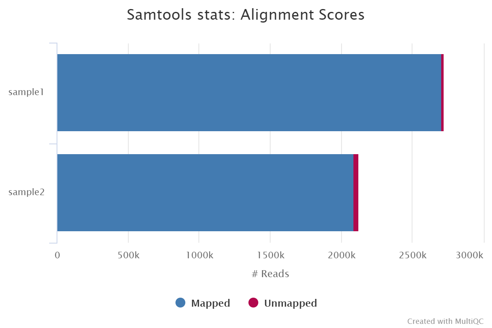

### Nanopore: mosdepth

<details markdown="1">
<summary>Output files</summary>

- `<CALLER>/mosdepth/genome/`
  - `all_samples.mosdepth.coverage.tsv`: File aggregating genome-wide coverage values across all samples used for plotting.
  - `*.mosdepth.coverage.pdf`: Whole-genome coverage plot.
  - `*.mosdepth.coverage.tsv`: File containing coverage values for the above plot.
  - `*.mosdepth.summary.txt`: Summary metrics including mean, min and max coverage values.
- `<CALLER>/mosdepth/amplicon/`
  - `all_samples.mosdepth.coverage.tsv`: File aggregating per-amplicon coverage values across all samples used for plotting.
  - `all_samples.mosdepth.heatmap.pdf`: Heatmap showing per-amplicon coverage across all samples.
  - `*.mosdepth.coverage.pdf`: Bar plot showing per-amplicon coverage for an individual sample.
  - `*.mosdepth.coverage.tsv`: File containing per-amplicon coverage values for the above plot.
  - `*.mosdepth.summary.txt`: Summary metrics including mean, min and max coverage values.

**NB:** The value of `<CALLER>` in the output directory name above is determined by the `--artic_minion_caller` parameter (Default: 'nanopolish').

</details>

[mosdepth](mosdepth) is a fast BAM/CRAM depth calculation for WGS, exome, or targeted sequencing. mosdepth is used in this pipeline to obtain genome-wide coverage values in 200bp windows and to obtain amplicon/region-specific coverage metrics. The results are then either rendered in MultiQC (genome-wide coverage) or are plotted using custom `R` scripts.


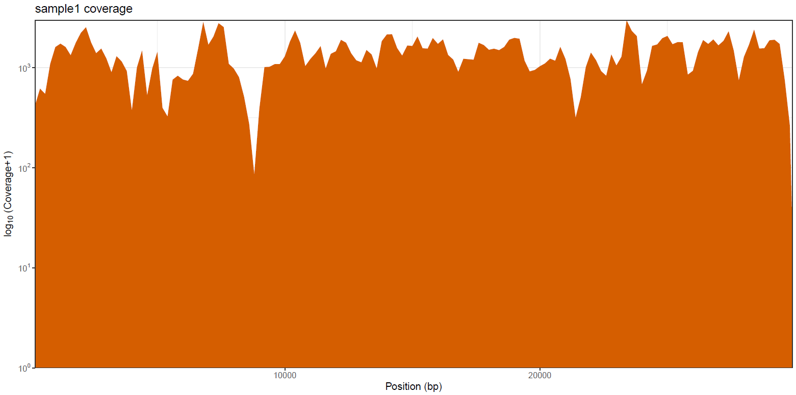

<p align="center">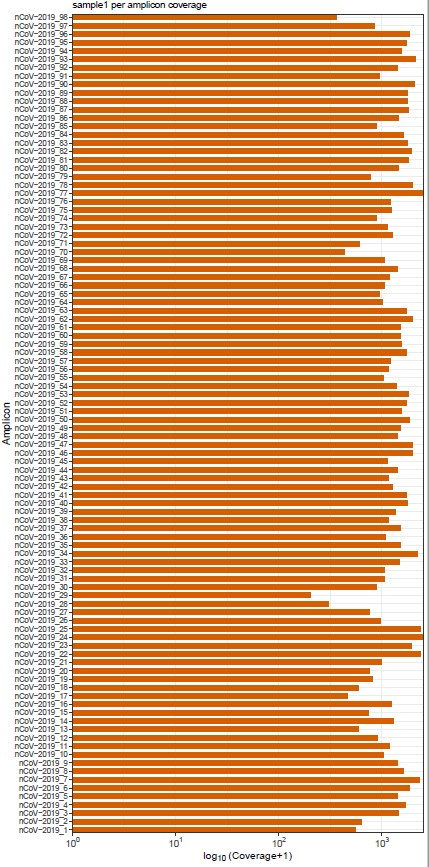</p>

### Nanopore: BCFTools

<details markdown="1">
<summary>Output files</summary>

- `<CALLER>/bcftools_stats/`
  - `*.bcftools_stats.txt`: Statistics and counts obtained from VCF file.

**NB:** The value of `<CALLER>` in the output directory name above is determined by the `--artic_minion_caller` parameter (Default: 'nanopolish').

</details>

[BCFtools](http://samtools.github.io/bcftools/bcftools.html) is a set of utilities that manipulate variant calls in [VCF](https://vcftools.github.io/specs.html) and its binary counterpart BCF format. It can also used be used to generate statistics and counts obtained from VCF files as used here.

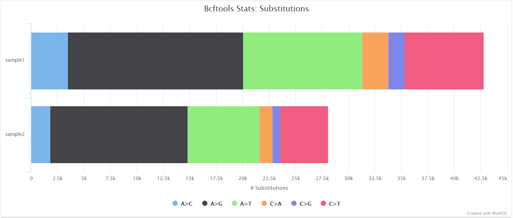

### Nanopore: SnpEff and SnpSift

<details markdown="1">
<summary>Output files</summary>

- `<CALLER>/snpeff/`
  - `*.snpeff.csv`: Variant annotation csv file.
  - `*.snpeff.genes.txt`: Gene table for annotated variants.
  - `*.snpeff.summary.html`: Summary html file for variants.
  - `*.snpeff.vcf.gz`: VCF file with variant annotations.
  - `*.snpeff.vcf.gz.tbi`: Index for VCF file with variant annotations.
  - `*.snpsift.txt`: SnpSift summary table.
- `<CALLER>/snpeff/bcftools_stats/`
  - `*.snpeff.bcftools_stats.txt`: Statistics and counts obtained from SnpEff VCF file.

**NB:** The value of `<CALLER>` in the output directory name above is determined by the `--artic_minion_caller` parameter (Default: 'nanopolish').

</details>

[SnpEff](http://snpeff.sourceforge.net/SnpEff.html) is a genetic variant annotation and functional effect prediction toolbox. It annotates and predicts the effects of genetic variants on genes and proteins (such as amino acid changes).

[SnpSift](http://snpeff.sourceforge.net/SnpSift.html) annotates genomic variants using databases, filters, and manipulates genomic annotated variants. After annotation with SnpEff, you can use SnpSift to help filter large genomic datasets in order to find the most significant variants.

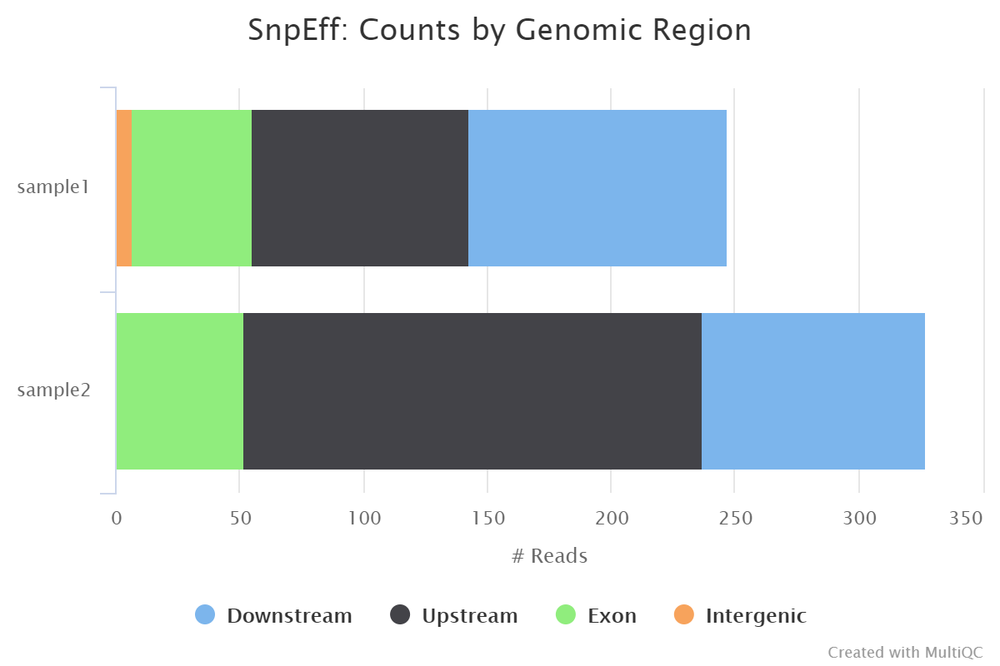

### Nanopore: QUAST

<details markdown="1">
<summary>Output files</summary>

- `<CALLER>/quast/`
  - `report.html`: Results report in HTML format. Also available in various other file formats i.e. `report.pdf`, `report.tex`, `report.tsv` and `report.txt`.

**NB:** The value of `<CALLER>` in the output directory name above is determined by the `--artic_minion_caller` parameter (Default: 'nanopolish').

</details>

[QUAST](http://bioinf.spbau.ru/quast) is used to generate a single report with which to evaluate the quality of the consensus sequence across all of the samples provided to the pipeline. The HTML results can be opened within any browser (we recommend using Google Chrome). Please see the [QUAST output docs](http://quast.sourceforge.net/docs/manual.html#sec3) for more detailed information regarding the output files.

### Nanopore: Pangolin

<details markdown="1">
<summary>Output files</summary>

- `<CALLER>/pangolin/`
  - `*.pangolin.csv`: Lineage analysis results from Pangolin.

**NB:** The value of `<CALLER>` in the output directory name above is determined by the `--artic_minion_caller` parameter (Default: 'nanopolish').

</details>

Phylogenetic Assignment of Named Global Outbreak LINeages ([Pangolin](https://github.com/cov-lineages/pangolin)) has been used extensively during the COVID-19 pandemic to assign lineages to SARS-CoV-2 genome sequenced samples. A [web application](https://pangolin.cog-uk.io/) also exists that allows users to upload genome sequences via a web browser to assign lineages to genome sequences of SARS-CoV-2, view descriptive characteristics of the assigned lineage(s), view the placement of the lineage in a phylogeny of global samples, and view the temporal and geographic distribution of the assigned lineage(s).

### Nanopore: Nextclade

<details markdown="1">
<summary>Output files</summary>

- `<CALLER>/nextclade/`
  - `*.csv`: Analysis results from Nextlade containing genome clade assignment, mutation calling and sequence quality checks.

**NB:** The value of `<CALLER>` in the output directory name above is determined by the `--artic_minion_caller` parameter (Default: 'nanopolish').

</details>

[Nextclade](https://github.com/nextstrain/nextclade) performs viral genome clade assignment, mutation calling and sequence quality checks for the consensus sequences generated in this pipeline. Similar to Pangolin, it has been used extensively during the COVID-19 pandemic. A [web application](https://clades.nextstrain.org/) also exists that allows users to upload genome sequences via a web browser.

### Nanopore: ASCIIGenome

<details markdown="1">
<summary>Output files</summary>

- `<CALLER>/asciigenome/<SAMPLE>/`
  - `*.pdf`: Individual variant screenshots with annotation tracks in PDF format.

**NB:** The value of `<CALLER>` in the output directory name above is determined by the `--artic_minion_caller` parameter (Default: 'nanopolish').

</details>

As described in the documentation, [ASCIIGenome](https://asciigenome.readthedocs.io/en/latest/) is a command-line genome browser that can be run from a terminal window and is solely based on ASCII characters. The closest program to ASCIIGenome is probably [samtools tview](http://www.htslib.org/doc/samtools-tview.html) but ASCIIGenome offers much more flexibility, similar to popular GUI viewers like the [IGV](https://software.broadinstitute.org/software/igv/) browser. We are using the batch processing mode of ASCIIGenome in this pipeline to generate individual screenshots for all of the variant sites reported for each sample in the VCF files. This is incredibly useful to be able to quickly QC the variants called by the pipeline without having to tediously load all of the relevant tracks into a conventional genome browser. Where possible, the BAM read alignments, VCF variant file, primer BED file and GFF annotation track will be represented in the screenshot for contextual purposes. The screenshot below shows a SNP called relative to the MN908947.3 SARS-CoV-2 reference genome that overlaps the ORF7a protein and the nCoV-2019_91_LEFT primer from the ARIC v3 protocol.

<p align="center">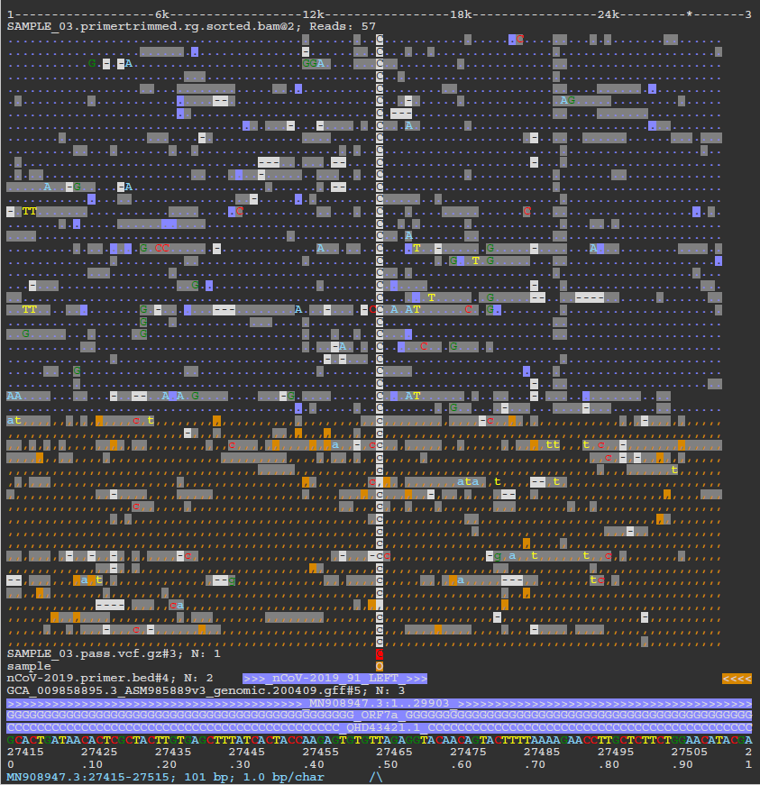</p>

### Nanopore: Variants long table

<details markdown="1">
<summary>Output files</summary>

- `<CALLER>/`
  - `variants_long_table.csv`: Long format table collating per-sample information for individual variants, functional effect prediction and lineage analysis.

**NB:** The value of `<CALLER>` in the output directory name above is determined by the `--artic_minion_caller` parameter (Default: 'nanopolish').

</details>

Create variants long format table collating per-sample information for individual variants ([`BCFTools`](http://samtools.github.io/bcftools/bcftools.html)), functional effect prediction ([`SnpSift`](http://snpeff.sourceforge.net/SnpSift.html)) and lineage analysis ([`Pangolin`](https://github.com/cov-lineages/pangolin)).

The more pertinent variant information is summarised in this table to make it easier for researchers to assess the impact of variants found amongst the sequenced sample(s). An example of the fields included in the table are shown below:

```bash
SAMPLE,CHROM,POS,REF,ALT,FILTER,DP,REF_DP,ALT_DP,AF,GENE,EFFECT,HGVS_C,HGVS_P,HGVS_P_1LETTER,CALLER,LINEAGE
SAMPLE1_PE,MN908947.3,241,C,T,PASS,489,4,483,0.99,orf1ab,upstream_gene_variant,c.-25C>T,.,.,ivar,B.1
SAMPLE1_PE,MN908947.3,1875,C,T,PASS,92,62,29,0.32,orf1ab,missense_variant,c.1610C>T,p.Ala537Val,p.A537V,ivar,B.1
SAMPLE1_PE,MN908947.3,3037,C,T,PASS,213,0,213,1.0,orf1ab,synonymous_variant,c.2772C>T,p.Phe924Phe,p.F924F,ivar,B.1
SAMPLE1_PE,MN908947.3,11719,G,A,PASS,195,9,186,0.95,orf1ab,synonymous_variant,c.11454G>A,p.Gln3818Gln,p.Q3818Q,ivar,B.1
```

## Nanopore: Workflow reporting

### Nanopore: MultiQC

<details markdown="1">
<summary>Output files</summary>

- `multiqc/<CALLER>/`
  - `multiqc_report.html`: a standalone HTML file that can be viewed in your web browser.
  - `multiqc_data/`: directory containing parsed statistics from the different tools used in the pipeline.
  - `summary_variants_metrics_mqc.csv`: file containing a selection of read alignmnet and variant calling metrics. The same metrics will also be added to the top of the MultiQC report.

</details>


Results generated by MultiQC collate pipeline QC from pycoQC, samtools, mosdepth, BCFTools, SnpEff and QUAST.

The default [`multiqc config file`](https://github.com/nf-core/viralrecon/blob/master/assets/multiqc_config_nanopore.yaml) has been written in a way in which to structure these QC metrics to make them more interpretable in the final report.

The pipeline has special steps which also allow the software versions to be reported in the MultiQC output for future traceability. For more information about how to use MultiQC reports, see <http://multiqc.info>.

An example MultiQC report generated from a full-sized dataset can be viewed on the [nf-core website](https://nf-co.re/viralrecon/results).

# Illumina: Pipeline overview

- [Preprocessing](#illumina-preprocessing)
  - [cat](#cat) - Merge re-sequenced FastQ files
  - [FastQC](#fastqc) - Raw read QC
  - [fastp](#fastp) - Adapter and quality trimming
  - [Kraken 2](#kraken-2) - Removal/QC for host reads
- [Variant calling](#illumina-variant-calling)
  - [Bowtie 2](#bowtie-2) - Read alignment relative to reference genome
  - [SAMtools](#samtools) - Sort, index and generate metrics for alignments
  - [iVar trim](#ivar-trim) - Primer sequence removal for amplicon data
  - [picard MarkDuplicates](#picard-markduplicates) - Duplicate read marking and removal
  - [picard CollectMultipleMetrics](#picard-collectmultiplemetrics) - Alignment metrics
  - [mosdepth](#mosdepth) - Whole-genome and amplicon coverage metrics
  - [iVar variants](#ivar-variants) _||_ [BCFTools call](#bcftools-call) - Variant calling
    - [SnpEff and SnpSift](#snpeff-and-snpsift) - Genetic variant annotation and functional effect prediction
    - [ASCIIGenome](#asciigenome) - Individual variant screenshots with annotation tracks
  - [iVar consensus](#ivar-consensus) _||_ [BCFTools and BEDTools](#bcftools-and-bedtools) - Consensus sequence generation
    - [QUAST](#quast) - Consensus assessment report
    - [Pangolin](#pangolin) - Lineage analysis
    - [Nextclade](#nextclade) - Clade assignment, mutation calling and sequence quality checks
  - [Variants long table](#variants-long-table) - Collate per-sample information for individual variants, functional effect prediction and lineage analysis
- [De novo assembly](#illumina-de-novo-assembly)
  - [Cutadapt](#cutadapt) - Primer trimming for amplicon data
  - [SPAdes](#spades) _||_ [Unicycler](#unicycler) _||_ [minia](#minia) - Viral genome assembly
    - [BLAST](#blast) - Blast to reference assembly
    - [ABACAS](#abacas) - Order contigs according to reference genome
    - [PlasmidID](#plasmidid) - Assembly report and visualisation
    - [Assembly QUAST](#assembly-quast) - Assembly quality assessment
- [Workflow reporting and genomes](#illumina-workflow-reporting-and-genomes)
  - [MultiQC](#multiqc) - Present QC for raw reads, alignment, assembly and variant calling
  - [Reference genome files](#reference-genome-files) - Save reference genome indices/files

## Illumina: Preprocessing

### cat

<details markdown="1">
<summary>Output files</summary>

- `fastq/`
  - `*.merged.fastq.gz`: These files are not saved by default but can be via a custom config file such as the one below.

```nextflow
params {
    modules {
        'illumina_cat_fastq' {
            publish_files = null
        }
    }
}
```

</details>

If multiple libraries/runs have been provided for the same sample in the input samplesheet (e.g. to increase sequencing depth) then these will be merged at the very beginning of the pipeline in order to have consistent sample naming throughout the pipeline. Please refer to the [usage documentation](https://nf-co.re/viralrecon/usage#illumina-samplesheet-format) to see how to specify these samples in the input samplesheet.

### FastQC

<details markdown="1">
<summary>Output files</summary>

- `fastqc/raw/`
  - `*_fastqc.html`: FastQC report containing quality metrics.
  - `*_fastqc.zip`: Zip archive containing the FastQC report, tab-delimited data file and plot images.

**NB:** The FastQC plots in this directory are generated relative to the raw, input reads. They may contain adapter sequence and regions of low quality. To see how your reads look after trimming please refer to the FastQC reports in the `fastqc/trim/` directory.

</details>

[FastQC](http://www.bioinformatics.babraham.ac.uk/projects/fastqc/) gives general quality metrics about your sequenced reads. It provides information about the quality score distribution across your reads, per base sequence content (%A/T/G/C), adapter contamination and overrepresented sequences. For further reading and documentation see the [FastQC help pages](http://www.bioinformatics.babraham.ac.uk/projects/fastqc/Help/).

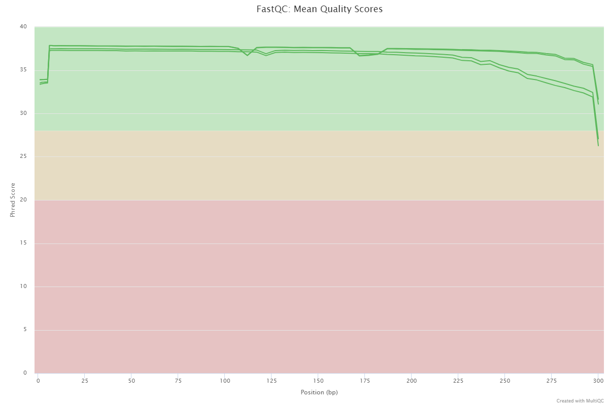

### fastp

<details markdown="1">
<summary>Output files</summary>

- `fastp/`
  - `*.fastp.html`: Trimming report in html format.
  - `*.fastp.json`: Trimming report in json format.
- `fastp/log/`
  - `*.fastp.log`: Trimming log file.
- `fastqc/trim/`
  - `*_fastqc.html`: FastQC report of the trimmed reads.
  - `*_fastqc.zip`: Zip archive containing the FastQC report, tab-delimited data file and plot images.

</details>

[fastp](https://github.com/OpenGene/fastp) is a tool designed to provide fast, all-in-one preprocessing for FastQ files. It has been developed in C++ with multithreading support to achieve higher performance. fastp is used in this pipeline for standard adapter trimming and quality filtering.

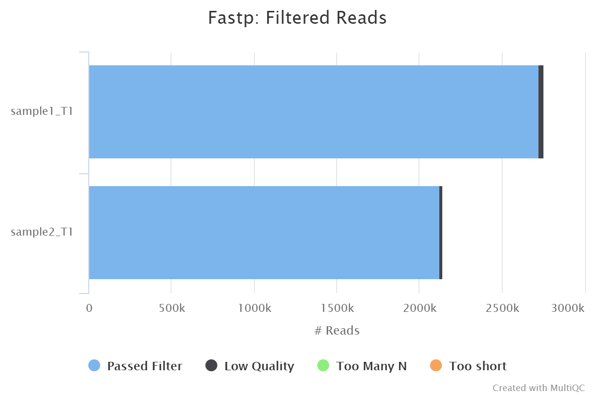

### Kraken 2

<details markdown="1">
<summary>Output files</summary>

- `kraken2/`
  - `*.kraken2.report.txt`: Kraken 2 taxonomic report. See [here](https://ccb.jhu.edu/software/kraken2/index.shtml?t=manual#sample-report-output-format) for a detailed description of the format.

</details>

[Kraken 2](https://ccb.jhu.edu/software/kraken2/index.shtml?t=manual) is a sequence classifier that assigns taxonomic labels to DNA sequences. Kraken 2 examines the k-mers within a query sequence and uses the information within those k-mers to query a database. That database maps k-mers to the lowest common ancestor (LCA) of all genomes known to contain a given k-mer.

We use a Kraken 2 database in this workflow to filter out reads specific to the host genome before performing the _de novo_ assembly steps in the pipeline. This filtering is not performed in the variant calling arm of the pipeline by default but Kraken 2 is still run to obtain an estimate of host reads, however, the filtering can be amended via the `--kraken2_variants_host_filter` parameter.

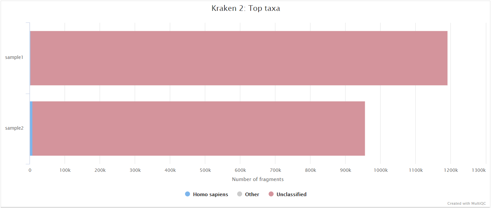

## Illumina: Variant calling

A file called `summary_variants_metrics_mqc.csv` containing a selection of read alignment and variant calling metrics will be saved in the `multiqc/` results directory. The same metrics will also be added to the top of the MultiQC report.

### Bowtie 2

<details markdown="1">
<summary>Output files</summary>

- `variants/bowtie2/log/`
  - `*.bowtie2.log`: Bowtie 2 mapping log file.

</details>

[Bowtie 2](http://bio-bwa.sourceforge.net/) is an ultrafast and memory-efficient tool for aligning sequencing reads to long reference sequences. Bowtie 2 supports gapped, local, and paired-end alignment modes.

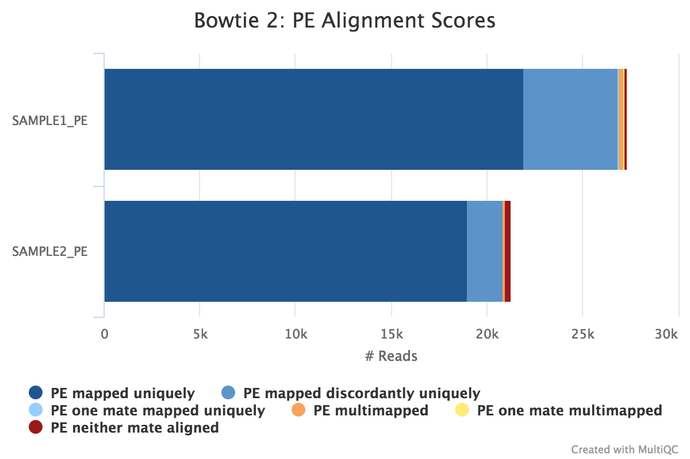

### SAMtools

<details markdown="1">
<summary>Output files</summary>

- `variants/bowtie2/`
  - `<SAMPLE>.sorted.bam`: Coordinate sorted BAM file containing read alignment information.
  - `<SAMPLE>.sorted.bam.bai`: Index file for coordinate sorted BAM file.
- `variants/bowtie2/samtools_stats/`
  - SAMtools `<SAMPLE>.sorted.bam.flagstat`, `<SAMPLE>.sorted.bam.idxstats` and `<SAMPLE>.sorted.bam.stats` files generated from the alignment files.

</details>

Bowtie 2 BAM files are further processed with [SAMtools](http://samtools.sourceforge.net/) to sort them by coordinate, for indexing, as well as to generate read mapping statistics.


### iVar trim

<details markdown="1">
<summary>Output files</summary>

- `variants/bowtie2/`
  - `*.ivar_trim.sorted.bam`: Coordinate sorted BAM file after primer trimming.
  - `*.ivar_trim.sorted.bam.bai`: Index file for coordinate sorted BAM file after primer trimming.
- `variants/bowtie2/samtools_stats/`
  - SAMtools `*.ivar_trim.sorted.bam.flagstat`, `*.ivar_trim.sorted.bam.idxstats` and `*.ivar_trim.sorted.bam.stats` files generated from the primer trimmed alignment files.
- `variants/bowtie2/log/`
  - `*.ivar_trim.ivar.log`: iVar trim log file obtained from stdout.

</details>

If the `--protocol amplicon` parameter is provided then [iVar](http://gensoft.pasteur.fr/docs/ivar/1.0/manualpage.html) is used to trim amplicon primer sequences from the aligned reads. iVar uses the primer positions supplied in `--primer_bed` to soft clip primer sequences from a coordinate sorted BAM file.

### picard MarkDuplicates

<details markdown="1">
<summary>Output files</summary>

- `variants/bowtie2/`
  - `*.markduplicates.sorted.bam`: Coordinate sorted BAM file after duplicate marking.
  - `*.markduplicates.sorted.bam.bai`: Index file for coordinate sorted BAM file after duplicate marking.
- `variants/bowtie2/samtools_stats/`
  - SAMtools `*.markduplicates.sorted.bam.flagstat`, `*.markduplicates.sorted.bam.idxstats` and `*.markduplicates.sorted.bam.stats` files generated from the duplicate marked alignment files.
- `variants/bowtie2/picard_metrics/`
  - `*.markduplicates.sorted.MarkDuplicates.metrics.txt`: Metrics file from MarkDuplicates.

</details>

Unless you are using [UMIs](https://emea.illumina.com/science/sequencing-method-explorer/kits-and-arrays/umi.html) it is not possible to establish whether the fragments you have sequenced from your sample were derived via true biological duplication (i.e. sequencing independent template fragments) or as a result of PCR biases introduced during the library preparation. [picard MarkDuplicates](https://gatk.broadinstitute.org/hc/en-us/articles/360037052812-MarkDuplicates-Picard-) isn't run by default because you anticipate high levels of duplication with viral data due to the size of the genome, however, you can activate it by adding `--skip_markduplicates false` to the command you use to run the pipeline. This will only _mark_ the duplicate reads identified amongst the alignments to allow you to guage the overall level of duplication in your samples. You can also choose to remove any reads identified as duplicates via the `--filter_duplicates` parameter.

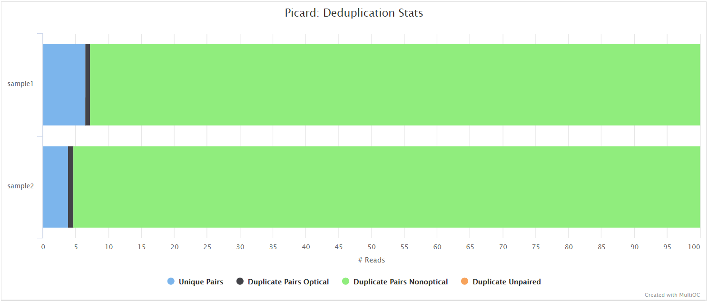

### picard CollectMultipleMetrics

<details markdown="1">
<summary>Output files</summary>

- `variants/bowtie2/picard_metrics/`
  - `*.CollectMultipleMetrics.*`: Alignment QC files from picard CollectMultipleMetrics in `*_metrics` textual format.
- `variants/bowtie2/picard_metrics/pdf/`
  - `*.pdf` plots for metrics obtained from CollectMultipleMetrics.

</details>

[picard-tools](https://broadinstitute.github.io/picard/command-line-overview.html) is a set of command-line tools for manipulating high-throughput sequencing data. We use picard-tools in this pipeline to obtain mapping and coverage metrics.

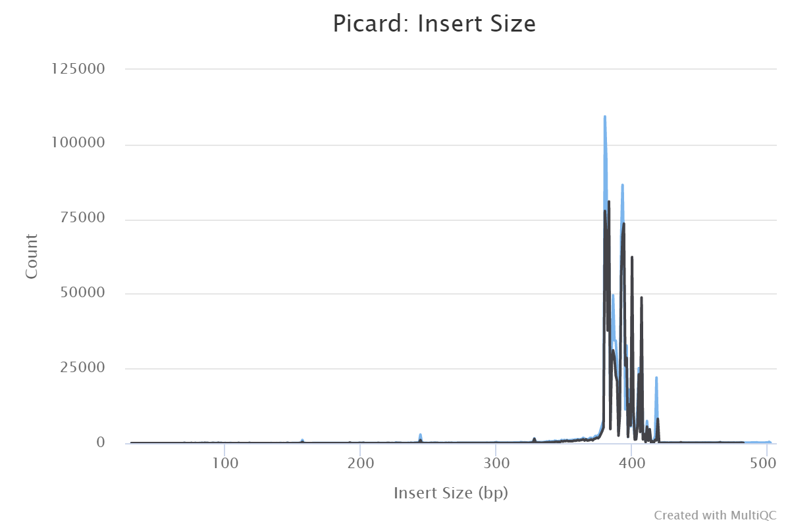

### mosdepth

<details markdown="1">
<summary>Output files</summary>

- `variants/bowtie2/mosdepth/genome/`
  - `all_samples.mosdepth.coverage.tsv`: File aggregating genome-wide coverage values across all samples used for plotting.
  - `*.mosdepth.coverage.pdf`: Whole-genome coverage plot.
  - `*.mosdepth.coverage.tsv`: File containing coverage values for the above plot.
  - `*.mosdepth.summary.txt`: Summary metrics including mean, min and max coverage values.
- `variants/bowtie2/mosdepth/amplicon/`
  - `all_samples.mosdepth.coverage.tsv`: File aggregating per-amplicon coverage values across all samples used for plotting.
  - `all_samples.mosdepth.heatmap.pdf`: Heatmap showing per-amplicon coverage across all samples.
  - `*.mosdepth.coverage.pdf`: Bar plot showing per-amplicon coverage for an individual sample.
  - `*.mosdepth.coverage.tsv`: File containing per-amplicon coverage values for the above plot.
  - `*.mosdepth.summary.txt`: Summary metrics including mean, min and max coverage values.

</details>

[mosdepth](mosdepth) is a fast BAM/CRAM depth calculation for WGS, exome, or targeted sequencing. mosdepth is used in this pipeline to obtain genome-wide coverage values in 200bp windows and for `--protocol amplicon` to obtain amplicon/region-specific coverage metrics. The results are then either rendered in MultiQC (genome-wide coverage) or are plotted using custom `R` scripts.


<p align="center"></p>

### iVar variants

<details markdown="1">
<summary>Output files</summary>

- `variants/ivar/`
  - `*.tsv`: Original iVar variants in TSV format.
  - `*.vcf.gz`: iVar variants in VCF format. Converted using custom `ivar_variants_to_vcf.py` python script.
  - `*.vcf.gz.tbi`: iVar variants VCF index file.
- `variants/ivar/log/`
  - `*.variant_counts.log`: Counts for type of variants called by iVar.
- `variants/ivar/bcftools_stats/`
  - `*.bcftools_stats.txt`: Statistics and counts obtained from iVar variants VCF file.

</details>

[iVar](https://github.com/andersen-lab/ivar/blob/master/docs/MANUAL.md) is a computational package that contains functions broadly useful for viral amplicon-based sequencing. We use iVar in this pipeline to [trim primer sequences](#ivar-trim) for amplicon input data as well as to call variants.

iVar outputs a tsv format which is not compatible with downstream analysis such as annotation using SnpEff. Moreover some issues need to be addressed such as [strand-bias filtering](https://github.com/andersen-lab/ivar/issues/5) and [the consecutive reporting of variants belonging to the same codon](https://github.com/andersen-lab/ivar/issues/92). This pipeline uses a custom Python script [ivar_variants_to_vcf.py](https://github.com/nf-core/viralrecon/blob/master/bin/ivar_variants_to_vcf.py) to convert the default iVar output to VCF whilst also addressing both of these issues.

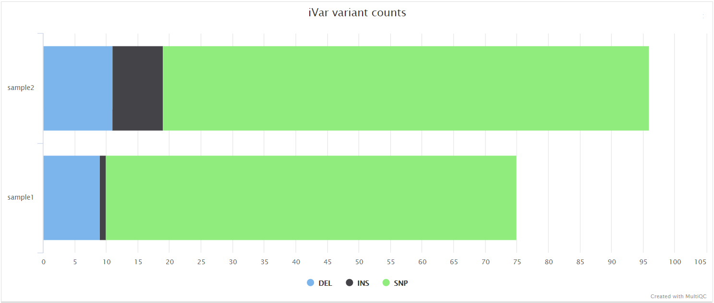

### BCFTools call

<details markdown="1">
<summary>Output files</summary>

- `variants/bcftools/`
  - `*.vcf.gz`: Variants VCF file.
  - `*.vcf.gz.tbi`: Variants VCF index file.
- `variants/bcftools/bcftools_stats/`
  - `*.bcftools_stats.txt`: Statistics and counts obtained from VCF file.

</details>

[BCFtools](http://samtools.github.io/bcftools/bcftools.html) can be used to call variants directly from BAM alignment files. It is a set of utilities that manipulate variant calls in [VCF](https://vcftools.github.io/specs.html) and its binary counterpart BCF format. BCFTools is used in the variant calling and _de novo_ assembly steps of this pipeline to obtain basic statistics from the VCF output.


### SnpEff and SnpSift

<details markdown="1">
<summary>Output files</summary>

- `variants/<CALLER>/snpeff/`
  - `*.snpeff.csv`: Variant annotation csv file.
  - `*.snpeff.genes.txt`: Gene table for annotated variants.
  - `*.snpeff.summary.html`: Summary html file for variants.
  - `*.snpeff.vcf.gz`: VCF file with variant annotations.
  - `*.snpeff.vcf.gz.tbi`: Index for VCF file with variant annotations.
  - `*.snpsift.txt`: SnpSift summary table.
- `variants/<CALLER>/snpeff/bcftools_stats/`
  - `*.bcftools_stats.txt`: Statistics and counts obtained from VCF file.

**NB:** The value of `<CALLER>` in the output directory name above is determined by the `--variant_caller` parameter (Default: 'ivar' for '--protocol amplicon' and 'bcftools' for '--protocol metagenomic').

</details>

[SnpEff](http://snpeff.sourceforge.net/SnpEff.html) is a genetic variant annotation and functional effect prediction toolbox. It annotates and predicts the effects of genetic variants on genes and proteins (such as amino acid changes).

[SnpSift](http://snpeff.sourceforge.net/SnpSift.html) annotates genomic variants using databases, filters, and manipulates genomic annotated variants. After annotation with SnpEff, you can use SnpSift to help filter large genomic datasets in order to find the most significant variants.


### ASCIIGenome

<details markdown="1">
<summary>Output files</summary>

- `variants/<CALLER>/asciigenome/<SAMPLE>/`
  - `*.pdf`: Individual variant screenshots with annotation tracks in PDF format.

**NB:** The value of `<CALLER>` in the output directory name above is determined by the `--variant_caller` parameter (Default: 'ivar' for '--protocol amplicon' and 'bcftools' for '--protocol metagenomic').

</details>

As described in the documentation, [ASCIIGenome](https://asciigenome.readthedocs.io/en/latest/) is a command-line genome browser that can be run from a terminal window and is solely based on ASCII characters. The closest program to ASCIIGenome is probably [samtools tview](http://www.htslib.org/doc/samtools-tview.html) but ASCIIGenome offers much more flexibility, similar to popular GUI viewers like the [IGV](https://software.broadinstitute.org/software/igv/) browser. We are using the batch processing mode of ASCIIGenome in this pipeline to generate individual screenshots for all of the variant sites reported for each sample in the VCF files. This is incredibly useful to be able to quickly QC the variants called by the pipeline without having to tediously load all of the relevant tracks into a conventional genome browser. Where possible, the BAM read alignments, VCF variant file, primer BED file and GFF annotation track will be represented in the screenshot for contextual purposes. The screenshot below shows a SNP called relative to the MN908947.3 SARS-CoV-2 reference genome that overlaps the ORF7a protein and the nCoV-2019_91_LEFT primer from the ARIC v3 protocol.

<p align="center"></p>

### iVar consensus

<details markdown="1">
<summary>Output files</summary>

- `variants/<CALLER>/consensus/ivar/`
  - `*.consensus.fa`: Consensus Fasta file generated by iVar.
  - `*.consensus.qual.txt`: File with the average quality of each base in the consensus sequence.
- `variants/<CALLER>/consensus/ivar/base_qc/`
  - `*.ACTG_density.pdf`: Plot showing density of ACGT bases within the consensus sequence.
  - `*.base_counts.pdf`: Plot showing frequency and percentages of all bases in consensus sequence.
  - `*.base_counts.tsv`: File containing frequency and percentages of all bases in consensus sequence.
  - `*.N_density.pdf`: Plot showing density of N bases within the consensus sequence.
  - `*.N_run.tsv`: File containing start positions and width of N bases in consensus sequence.

**NB:** The value of `<CALLER>` in the output directory name above is determined by the `--variant_caller` parameter (Default: 'ivar' for '--protocol amplicon' and 'bcftools' for '--protocol metagenomic').

</details>

As described in the [iVar variants](#ivar-variants) section, iVar can be used in this pipeline to call variants and for the consensus sequence generation.

### BCFTools and BEDTools

<details markdown="1">
<summary>Output files</summary>

- `variants/<CALLER>/consensus/bcftools/`
  - `*.consensus.fa`: Consensus fasta file generated by integrating the high allele-frequency variants called by iVar/BCFTools into the reference genome.
  - `*.filtered.vcf.gz`: VCF file containing high allele-frequency variants (default: `>= 0.75`) that were integrated into the consensus sequence.
  - `*.filtered.vcf.gz.tbi`: Variants VCF index file for high allele frequency variants.
- `variants/<CALLER>/consensus/bcftools/base_qc/`
  - `*.ACTG_density.pdf`: Plot showing density of ACGT bases within the consensus sequence.
  - `*.base_counts.pdf`: Plot showing frequency and percentages of all bases in consensus sequence.
  - `*.base_counts.tsv`: File containing frequency and percentages of all bases in consensus sequence.
  - `*.N_density.pdf`: Plot showing density of N bases within the consensus sequence.
  - `*.N_run.tsv`: File containing start positions and width of N bases in consensus sequence.

**NB:** The value of `<CALLER>` in the output directory name above is determined by the `--variant_caller` parameter (Default: 'ivar' for '--protocol amplicon' and 'bcftools' for '--protocol metagenomic').

</details>

[BCFTools](http://samtools.github.io/bcftools/bcftools.html) is used in the variant calling and _de novo_ assembly steps of this pipeline to obtain basic statistics from the VCF output. It can also used be used to generate a consensus sequence by integrating variant calls into the reference genome. In this pipeline, we use `samtools mpileup` to create a mask using low coverage positions, and `bedtools maskfasta` to mask the genome sequences based on these intervals. Finally, `bcftools consensus` is used to generate the consensus by projecting the high allele frequency variants onto the masked genome reference sequence.

### QUAST

<details markdown="1">
<summary>Output files</summary>

- `variants/<VARIANT_CALLER>/consensus/<CONSENSUS_CALLER>/quast/`
  - `report.html`: Results report in HTML format. Also available in various other file formats i.e. `report.pdf`, `report.tex`, `report.tsv` and `report.txt`.

**NB:** The value of `<VARIANT_CALLER>` in the output directory name above is determined by the `--variant_caller` parameter (Default: 'ivar' for '--protocol amplicon' and 'bcftools' for '--protocol metagenomic').
**NB:** The value of `<CONSENSUS_CALLER>` in the output directory name above is determined by the `--consensus_caller` parameter (Default: 'bcftools' for both '--protocol amplicon' and '--protocol metagenomic').

</details>

[QUAST](http://bioinf.spbau.ru/quast) is used to generate a single report with which to evaluate the quality of the consensus sequence across all of the samples provided to the pipeline. The HTML results can be opened within any browser (we recommend using Google Chrome). Please see the [QUAST output docs](http://quast.sourceforge.net/docs/manual.html#sec3) for more detailed information regarding the output files.

### Pangolin

<details markdown="1">
<summary>Output files</summary>

- `variants/<VARIANT_CALLER>/consensus/<CONSENSUS_CALLER>/pangolin/`
  - `*.pangolin.csv`: Lineage analysis results from Pangolin.

**NB:** The value of `<VARIANT_CALLER>` in the output directory name above is determined by the `--variant_caller` parameter (Default: 'ivar' for '--protocol amplicon' and 'bcftools' for '--protocol metagenomic').
**NB:** The value of `<CONSENSUS_CALLER>` in the output directory name above is determined by the `--consensus_caller` parameter (Default: 'bcftools' for both '--protocol amplicon' and '--protocol metagenomic').

</details>

Phylogenetic Assignment of Named Global Outbreak LINeages ([Pangolin](https://github.com/cov-lineages/pangolin)) has been used extensively during the COVID-19 pandemic in order to to assign lineages to SARS-CoV-2 genome sequenced samples. A [web application](https://pangolin.cog-uk.io/) also exists that allows users to upload genome sequences via a web browser to assign lineages to genome sequences of SARS-CoV-2, view descriptive characteristics of the assigned lineage(s), view the placement of the lineage in a phylogeny of global samples, and view the temporal and geographic distribution of the assigned lineage(s).

### Nextclade

<details markdown="1">
<summary>Output files</summary>

- `variants/<VARIANT_CALLER>/consensus/<CONSENSUS_CALLER>/nextclade/`
  - `*.csv`: Analysis results from Nextlade containing genome clade assignment, mutation calling and sequence quality checks.

**NB:** The value of `<VARIANT_CALLER>` in the output directory name above is determined by the `--variant_caller` parameter (Default: 'ivar' for '--protocol amplicon' and 'bcftools' for '--protocol metagenomic').
**NB:** The value of `<CONSENSUS_CALLER>` in the output directory name above is determined by the `--consensus_caller` parameter (Default: 'bcftools' for both '--protocol amplicon' and '--protocol metagenomic').

</details>

[Nextclade](https://github.com/nextstrain/nextclade) performs viral genome clade assignment, mutation calling and sequence quality checks for the consensus sequences generated in this pipeline. Similar to Pangolin, it has been used extensively during the COVID-19 pandemic. A [web application](https://clades.nextstrain.org/) also exists that allows users to upload genome sequences via a web browser.

### Variants long table

<details markdown="1">
<summary>Output files</summary>

- `variants/<VARIANT_CALLER>/`
  - `variants_long_table.csv`: Long format table collating per-sample information for individual variants, functional effect prediction and lineage analysis.

**NB:** The value of `<VARIANT_CALLER>` in the output directory name above is determined by the `--variant_caller` parameter (Default: 'ivar' for '--protocol amplicon' and 'bcftools' for '--protocol metagenomic').

</details>

Create variants long format table collating per-sample information for individual variants ([`BCFTools`](http://samtools.github.io/bcftools/bcftools.html)), functional effect prediction ([`SnpSift`](http://snpeff.sourceforge.net/SnpSift.html)) and lineage analysis ([`Pangolin`](https://github.com/cov-lineages/pangolin)).

The more pertinent variant information is summarised in this table to make it easier for researchers to assess the impact of variants found amongst the sequenced sample(s). An example of the fields included in the table are shown below:

```bash
SAMPLE,CHROM,POS,REF,ALT,FILTER,DP,REF_DP,ALT_DP,AF,GENE,EFFECT,HGVS_C,HGVS_P,HGVS_P_1LETTER,CALLER,LINEAGE
SAMPLE1_PE,MN908947.3,241,C,T,PASS,489,4,483,0.99,orf1ab,upstream_gene_variant,c.-25C>T,.,.,ivar,B.1
SAMPLE1_PE,MN908947.3,1875,C,T,PASS,92,62,29,0.32,orf1ab,missense_variant,c.1610C>T,p.Ala537Val,p.A537V,ivar,B.1
SAMPLE1_PE,MN908947.3,3037,C,T,PASS,213,0,213,1.0,orf1ab,synonymous_variant,c.2772C>T,p.Phe924Phe,p.F924F,ivar,B.1
SAMPLE1_PE,MN908947.3,11719,G,A,PASS,195,9,186,0.95,orf1ab,synonymous_variant,c.11454G>A,p.Gln3818Gln,p.Q3818Q,ivar,B.1
```

## Illumina: De novo assembly

A file called `summary_assembly_metrics_mqc.csv` containing a selection of read alignment and _de novo_ assembly related metrics will be saved in the `multiqc/` results directory. The same metrics will also be added to the top of the MultiQC report.

### Cutadapt

<details markdown="1">
<summary>Output files</summary>

- `assembly/cutadapt/log/`
  - `*.cutadapt.log`: Cutadapt log file generated from stdout.
- `assembly/cutadapt/fastqc/`
  - `*_fastqc.html`: FastQC report of the trimmed reads.
  - `*_fastqc.zip`: Zip archive containing the FastQC report.

</details>

In the variant calling branch of the pipeline we are using [iVar trim](#ivar-trim) to remove primer sequences from the aligned BAM files for amplicon data. Since in the _de novo_ assembly branch we don't align the reads, we use [Cutadapt](https://cutadapt.readthedocs.io/en/stable/guide.html) as an alternative option to remove and clean the primer sequences directly from FastQ files.

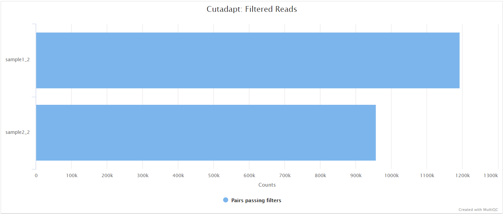

### SPAdes

<details markdown="1">
<summary>Output files</summary>

- `assembly/spades/<SPADES_MODE>/`
  - `*.scaffolds.fa.gz`: SPAdes scaffold assembly.
  - `*.contigs.fa.gz`: SPAdes assembly contigs.
  - `*.assembly.gfa.gz`: SPAdes assembly graph in [GFA](https://github.com/GFA-spec/GFA-spec/blob/master/GFA1.md) format.
- `assembly/spades/<SPADES_MODE>/bandage/`
  - `*.png`: Bandage visualisation for SPAdes assembly graph in PNG format.
  - `*.svg`: Bandage visualisation for SPAdes assembly graph in SVG format.

**NB:** The value of `<SPADES_MODE>` in the output directory name above is determined by the `--spades_mode` parameter (Default: 'rnaviral').

</details>

[SPAdes](http://cab.spbu.ru/software/spades/) is an assembly toolkit containing various assembly pipelines. Generically speaking, SPAdes is one of the most popular de Bruijn graph-based assembly algorithms used for bacterial/viral genome reconstruction.

[Bandage](https://rrwick.github.io/Bandage/) is a program for visualising _de novo_ assembly graphs. By displaying connections which are not present in the contigs file, Bandage opens up new possibilities for analysing _de novo_ assemblies.

### Unicycler

<details markdown="1">
<summary>Output files</summary>

- `assembly/unicycler/`
  - `*.scaffolds.fa.gz`: Unicycler scaffold assembly.
  - `*.assembly.gfa.gz`: Unicycler assembly graph in GFA format.
- `assembly/unicycler/bandage/`
  - `*.png`: Bandage visualisation for Unicycler assembly graph in PNG format.
  - `*.svg`: Bandage visualisation for Unicycler assembly graph in SVG format.

</details>

[Unicycler](https://github.com/rrwick/Unicycler) is an assembly pipeline for bacterial genomes. It can assemble Illumina-only read sets where it functions as a SPAdes-optimiser.

### minia

<details markdown="1">
<summary>Output files</summary>

- `assembly/minia/`
  - `*.contigs.fa`: Minia scaffold assembly.
  - `*.unitigs.fa`: Minia unitigs fasta file.
  - `*.h5`: Minia h5 output file.

</details>

[Minia](https://github.com/GATB/minia) is a short-read assembler based on a de Bruijn graph, capable of assembling a human genome on a desktop computer in a day. The output of Minia is a set of contigs. Minia produces results of similar contiguity and accuracy to other de Bruijn assemblers.

### BLAST

<details markdown="1">
<summary>Output files</summary>

- `assembly/<ASSEMBLER>/blastn/`
  - `*.blastn.txt`: BLAST results against the target virus.
  - `*.filter.blastn.txt`: Filtered BLAST results.

**NB:** The value of `<ASSEMBLER>` in the output directory name above is determined by the `--assemblers` parameter (Default: 'spades').

</details>

[blastn](https://blast.ncbi.nlm.nih.gov/Blast.cgi?PAGE_TYPE=BlastSearch) is used to align the assembled contigs against the virus reference genome.

### ABACAS

<details markdown="1">
<summary>Output files</summary>

- `assembly/<ASSEMBLER>/abacas/`
  - `*.abacas.bin`: Bin file that contains contigs that are not used in ordering.
  - `*.abacas.crunch`: Comparison file.
  - `*.abacas.fasta`: Ordered and orientated sequence file.
  - `*.abacas.gaps`: Gap information.
  - `*.abacas.gaps.tab`: Gap information in tab-delimited format.
  - `*.abacas.MULTIFASTA.fa`: A list of ordered and orientated contigs in a multi-fasta format.
  - `*.abacas.tab`: Feature file
  - `*.unused_contigs.out`: Information on contigs that have a mapping information but could not be used in the ordering.
- `assembly/<ASSEMBLER>/abacas/nucmer/`: Folder containing the files generated by the NUCmer algorithm used by ABACAS.

**NB:** The value of `<ASSEMBLER>` in the output directory name above is determined by the `--assemblers` parameter (Default: 'spades').

</details>

[ABACAS](https://www.sanger.ac.uk/science/tools/pagit) was developed to rapidly contiguate (align, order, orientate), visualize and design primers to close gaps on shotgun assembled contigs based on a reference sequence.

### PlasmidID

<details markdown="1">
<summary>Output files</summary>

- `assembly/<ASSEMBLER>/plasmidid/<SAMPLE>/`
  - `*_final_results.html`: Summary file with reference coverage stats and contigs for visualization.
  - `*_final_results.tab`: Summary file with reference coverage stats and contigs.
  - `images/<SAMPLE>_<REF_NAME>.png`: PNG file with the visualization of the alignment between the viral assembly and the reference viral genome.
  - `logs/`: Log files.

**NB:** The value of `<ASSEMBLER>` in the output directory name above is determined by the `--assemblers` parameter (Default: 'spades').

</details>

[PlasmidID](https://github.com/BU-ISCIII/plasmidID) was used to graphically represent the alignment of the reference genome relative to a given assembly. This helps to visualize the coverage of the reference genome in the assembly. To find more information about the output files refer to the [documentation](https://github.com/BU-ISCIII/plasmidID/wiki/Understanding-the-image:-track-by-track).

### Assembly QUAST

<details markdown="1">
<summary>Output files</summary>

- `assembly/<ASSEMBLER>/quast/`
  - `report.html`: Results report in HTML format. Also available in various other file formats i.e. `report.pdf`, `report.tex`, `report.tsv` and `report.txt`.

**NB:** The value of `<ASSEMBLER>` in the output directory name above is determined by the `--assemblers` parameter (Default: 'spades').

</details>

[QUAST](http://bioinf.spbau.ru/quast) is used to generate a single report with which to evaluate the quality of the _de novo_ assemblies across all of the samples provided to the pipeline. The HTML results can be opened within any browser (we recommend using Google Chrome). Please see the [QUAST output docs](http://quast.sourceforge.net/docs/manual.html#sec3) for more detailed information regarding the output files.

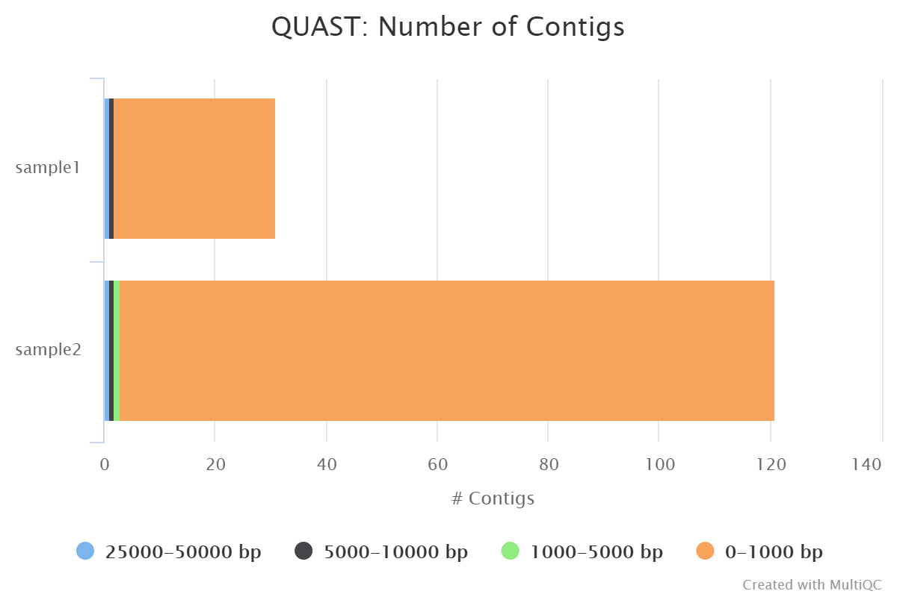

## Illumina: Workflow reporting and genomes

### MultiQC

<details markdown="1">
<summary>Output files</summary>

- `multiqc/`
  - `multiqc_report.html`: a standalone HTML file that can be viewed in your web browser.
  - `multiqc_data/`: directory containing parsed statistics from the different tools used in the pipeline.
  - `summary_variants_metrics_mqc.csv`: file containing a selection of read alignment and variant calling metrics. The same metrics will also be added to the top of the MultiQC report.
  - `summary_assembly_metrics_mqc.csv`: file containing a selection of read alignment and _de novo_ assembly related metrics. The same metrics will also be added to the top of the MultiQC report.

</details>

[MultiQC](http://multiqc.info) is a visualization tool that generates a single HTML report summarizing all samples in your project. Most of the pipeline QC results are visualised in the report and further statistics are available in the report data directory.

Results generated by MultiQC collate pipeline QC from FastQC, fastp, Cutadapt, Bowtie 2, Kraken 2, samtools, picard CollectMultipleMetrics, BCFTools, SnpEff and QUAST.

The default [`multiqc config file`](https://github.com/nf-core/viralrecon/blob/master/assets/multiqc_config_illumina.yaml) has been written in a way in which to structure these QC metrics to make them more interpretable in the final report.

The pipeline has special steps which also allow the software versions to be reported in the MultiQC output for future traceability. For more information about how to use MultiQC reports, see <http://multiqc.info>.

An example MultiQC report generated from a full-sized dataset can be viewed on the [nf-core website](https://nf-co.re/viralrecon/results).

### Reference genome files

<details markdown="1">
<summary>Output files</summary>

- `genome/`
  - `bowtie2/`: Bowtie 2 index for viral genome.
  - `blast_db/`: BLAST database for viral genome.
  - `kraken2_db/`: Kraken 2 database for host genome.
  - `snpeff_db/`: SnpEff database for viral genome.
  - `snpeff.config`: SnpEff config file for viral genome.
  - Unzipped genome fasta file for viral genome
  - Unzipped genome annotation GFF file for viral genome

</details>

A number of genome-specific files are generated by the pipeline because they are required for the downstream processing of the results. If the `--save_reference` parameter is provided then the Bowtie 2 alignment indices, BLAST and Kraken 2 databases downloaded/generated by the pipeline will be saved in the `genome/` directory. It is recommended to use the `--save_reference` parameter if you are using the pipeline to build a Kraken 2 database for the host genome. This can be quite a time-consuming process and it permits their reuse for future runs of the pipeline or for other purposes.

# Pipeline information

<details markdown="1">
<summary>Output files</summary>

- `pipeline_info/`
  - Reports generated by Nextflow: `execution_report.html`, `execution_timeline.html`, `execution_trace.txt` and `pipeline_dag.dot`/`pipeline_dag.svg`.
  - Reports generated by the pipeline: `pipeline_report.html`, `pipeline_report.txt` and `software_versions.yml`. The `pipeline_report*` files will only be present if the `--email` / `--email_on_fail` parameter's are used when running the pipeline.
  - Reformatted samplesheet files used as input to the pipeline: `samplesheet.valid.csv`.

</details>

[Nextflow](https://www.nextflow.io/docs/latest/tracing.html) provides excellent functionality for generating various reports relevant to the running and execution of the pipeline. This will allow you to troubleshoot errors with the running of the pipeline, and also provide you with other information such as launch commands, run times and resource usage.
