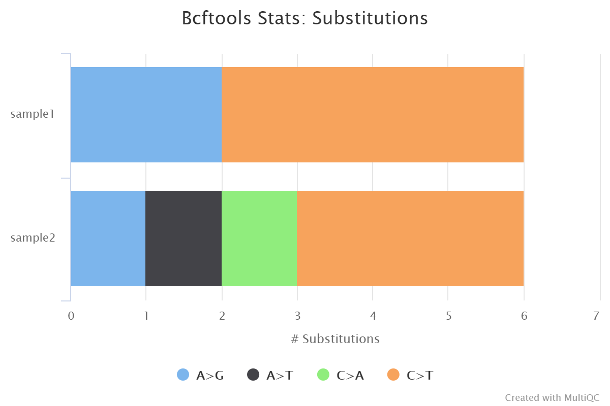

# 

This document describes the output produced by the pipeline. Most of the plots are taken from the MultiQC report, which summarises results at the end of the pipeline.

The directories listed below will be created in the results directory after the pipeline has finished. All paths are relative to the top-level results directory.

## Pipeline overview

The pipeline is built using [Nextflow](https://www.nextflow.io/) and processes data using the following steps:

* [Preprocessing](#Preprocessing)
  * [parallel-fastq-dump](#parallel-fastq-dump) - Download samples from SRA
  * [FastQC](#fastqc) - Raw read QC
  * [fastp](#fastp) - Adapter and quality trimming
  * [cat](#cat) - Merge re-sequenced FastQ files
* [Variant calling](#variant-calling)
  * [Bowtie 2](#bowtie-2) - Read alignment relative to reference genome
  * [SAMtools](#samtools) - Sort, index and generate metrics for alignments
  * [iVar trim](#ivar-trim) - Primer sequence removal for amplicon data
  * [picard-tools](#picard-tools) - Whole genome coverage and alignment metrics
  * [VarScan 2, BCFTools, BEDTools](#varscan-2-bcftools-bedtools) **|** [iVar variants and iVar consensus](#ivar-variants-and-ivar-consensus) - Variant calling and consensus sequence generation
    * [SnpEff and SnpSift](#snpeff-and-snpsift) - Genetic variant annotation and functional effect prediction
    * [QUAST](#quast) - Consensus assessment report
* [De novo assembly](#de-novo-assembly)
  * [Cutadapt](#cutadapt) - Primer trimming for amplicon data
  * [Kraken 2](#kraken-2) - Removal of host reads
  * [SPAdes](#spades) **|** [metaSPAdes](#metaspades) **|** [metaSPAdes](#metaspades) **|** [minia](#minia) - Viral genome assembly
    * [BLAST](#blast) - Blast to reference assembly
    * [ABACAS](#abacas) - Order contigs according to reference genome
    * [PlasmidID](#plasmidid) - Assembly report and visualisation
    * [Assembly QUAST](#assembly-quast) - Assembly quality assessment
    * [Minimap2, seqwish, vg](#minimap2-seqwish-vg) - Call variants relative to reference
    * [Assembly SnpEff and SnpSift](#assembly-snpeff-and-snpsift) - Genetic variant annotation and functional effect prediction
* [Workflow reporting and genomes](#workflow-reporting-and-genomes)
  * [MultiQC](#multiqc) - Present QC for raw reads, alignment, assembly and variant calling
  * [Reference genome files](#reference-genome-files) - Saving reference genome indices/files
  * [Pipeline information](#pipeline-information) - Report metrics generated during the workflow execution

## Preprocessing

### parallel-fastq-dump

Please see the [usage docs](usage.md#supported-public-repository-ids) for a list of supported public repository identifiers and how to provide them to the pipeline. The final sample information for all identifiers is obtained from the ENA which provides direct download links for FastQ files as well as their associated md5 sums. If download links exist, the files will be downloaded by FTP otherwise they will be downloaded using [`parallel-fastq-dump`](https://github.com/rvalieris/parallel-fastq-dump).

**Output files:**

* `preprocess/sra/`
  * `*.fastq.gz`: Paired-end/single-end reads downloaded and extracted from the SRA.
* `preprocess/sra/log/`
  * `*.fastq_dump.log`: Log file generated from stdout.

> **NB:** Downloaded FastQ files will only be saved in the results directory if the `--save_sra_fastq` parameter is supplied.  
> **NB:** A metadata (`*.sra_runinfo.txt`) and warnings (`*.sra_warnings.txt`) file is also saved in the `pipeline_info/` directory.

### FastQC

[FastQC](http://www.bioinformatics.babraham.ac.uk/projects/fastqc/) gives general quality metrics about your sequenced reads. It provides information about the quality score distribution across your reads, per base sequence content (%A/T/G/C), adapter contamination and overrepresented sequences. For further reading and documentation see the [FastQC help pages](http://www.bioinformatics.babraham.ac.uk/projects/fastqc/Help/).

**Output files:**

* `preprocess/fastqc/`
  * `*_fastqc.html`: FastQC report containing quality metrics.
* `preprocess/fastqc/zips/`
  * `*_fastqc.zip`: Zip archive containing the FastQC report, tab-delimited data file and plot images.

  

> **NB:** The FastQC plots in this directory are generated relative to the raw, input reads. They may contain adapter sequence and regions of low quality. To see how your reads look after trimming please refer to the FastQC reports in the `preprocess/fastp/fastqc/` directory.

### fastp

[fastp](https://github.com/OpenGene/fastp) is a tool designed to provide fast, all-in-one preprocessing for FastQ files. It has been developed in C++ with multithreading support to afford high performance. fastp is used in this pipeline for standard adapter trimming and quality filtering.

**Output files:**

* `preprocess/fastp/`
  * `*.fastp.html`: Trimming report in html format.
  * `*.fastp.json`: Trimming report in json format.
  * `*.trim.fastq.gz`: Paired-end/single-end trimmed reads.
  * `*.trim.fail.gz`: Unpaired trimmed reads (only for paired-end data).  
* `preprocess/fastp/log/`
  * `*.fastp.log`: Trimming log file.
* `preprocess/fastp/fastqc/`:
  * `*.trim_fastqc.html`: FastQC report of the trimmed reads.
* `preprocess/fastp/fastqc/zips/`
  * `*.trim_fastqc.zip`: Zip archive containing the FastQC report.

  

> **NB:** Post-trimmed FastQ files will only be saved in the results directory if the `--save_trimmed` parameter is supplied.

### cat

The initial QC and adapter trimming for each sample is performed at the run-level e.g. if a sample has been sequenced more than once to increase sequencing depth. This has the advantage of being able to assess each library individually, and the ability to process multiple libraries from the same sample in parallel. If applicable, these samples are subsequently merged using the Linux `cat` command after the fastp adapter trimming step.

## Variant calling

### Bowtie 2

[Bowtie 2](http://bio-bwa.sourceforge.net/) is an ultrafast and memory-efficient tool for aligning sequencing reads to long reference sequences. Bowtie 2 supports gapped, local, and paired-end alignment modes.

**Output files:**

* `variants/bowtie2/`
  * `*.sorted.bam`: Coordinate sorted BAM file containing read alignment information.
  * `*.sorted.bam.bai`: Index file for coordinate sorted BAM file.
  * `<SAMPLE>.bam`: Original output BAM file containing mapped reads. Only present if `--save_align_intermeds` parameter is supplied.
* `variants/bowtie2/log/`
  * `*.log`: Bowtie 2 mapping log file.

  

### SAMtools

Bowtie 2 BAM files are further processed with [SAMtools](http://samtools.sourceforge.net/) to coordinate sort and index the alignments, as well as to generate read mapping statistics.

**Output files:**

* `variants/bowtie2/samtools_stats/`
  * SAMtools `*.flagstat`, `*.idxstats` and `*.stats` files generated from the alignment files.

  

### iVar trim

If the `--protocol amplicon` parameter is provided then [iVar](http://gensoft.pasteur.fr/docs/ivar/1.0/manualpage.html) is used to trim amplicon primer sequences from the reads. iVar uses the primer positions supplied in `--amplicon_bed` to soft clip primer sequences from a coordinate sorted BAM file.

**Output files:**

* `variants/ivar/`
  * `*.trim.sorted.bam`: Coordinate sorted BAM file after primer trimming.
  * `*.trim.sorted.bam.bai`: Index file for coordinate sorted BAM file after primer trimming.
* `variants/ivar/log/`
  * `*.trim.ivar.log`: iVar trim log file obtained from stdout.
* `variants/ivar/samtools_stats/`
  * SAMtools `*.flagstat`, `*.idxstats` and `*.stats` files generated from the primer trimmed alignment files.

### picard-tools

[picard-tools](https://broadinstitute.github.io/picard/command-line-overview.html) is a set of command-line tools for manipulating high-throughput sequencing data. We use picard-tools in this pipeline to obtain mapping and coverage metrics. If `--protocol amplicon` is set then these metrics will be obtained from the iVar trimmed alignments as opposed to the original Bowtie 2 alignments.

**Output files:**

* `variants/<bowtie2/ivar>/picard_metrics/`  
  Alignment QC files from picard CollectMultipleMetrics and the metrics file from CollectWgsMetrics in `*_metrics` text format and plotted in `*.pdf` format.

  

### VarScan 2, BCFTools, BEDTools

[VarScan 2](http://dkoboldt.github.io/varscan/) is a platform-independent software tool developed at the Genome Institute, Washington University to detect variants in NGS data. In this pipeline, VarScan 2 is used in conjunction with SAMtools in order to call both high and low frequency variants.

[BCFtools](http://samtools.github.io/bcftools/bcftools.html) is a set of utilities that manipulate variant calls in [VCF](https://vcftools.github.io/specs.html) and its binary counterpart BCF format. BCFTools is used in the variant calling and *de novo* assembly steps of this pipeline to obtain basic statistics from the VCF output. It is also used in the VarScan 2 variant calling branch of the pipeline to generate a consensus sequence by integrating high frequency variant calls into the reference genome.

[BEDTools](https://bedtools.readthedocs.io/en/latest/) is a swiss-army knife of tools for a wide-range of genomics analysis tasks. In this pipeline we use `bedtools genomecov` to compute the per-base mapped read coverage in bedGraph format, and `bedtools maskfasta` to mask sequences in a Fasta file based on intervals defined in a feature file. This may be useful for creating your own masked genome file based on custom annotations or for masking all but your target regions when aligning sequence data from a targeted capture experiment.

**Output files:**

* `variants/varscan2/`
  * `*.highfreq.vcf.gz`: High frequency variants VCF file.
  * `*.highfreq.vcf.gz.tbi`: High frequency variants VCF index file.
  * `*.lowfreq.vcf.gz`: Low frequency variants VCF file.
  * `*.lowfreq.vcf.gz.tbi`: Low frequency variants VCF index file.
  * `*.pileup`: Pileup files summarize all the data from aligned reads at a given genomic position. Each row of the pileup file gives similar information to a single vertical column of reads as visualised in IGV.
* `variants/varscan2/consensus/`
  * `*.consensus.fa`: Consensus Fasta file generated by integrating the high frequency variants called by VarScan into the reference genome.
  * `*.consensus.masked.fa`: Masked consensus Fasta file.
* `variants/varscan2/log/`
  * `*.highfreq.varscan2.log`: High frequency variants log file generated from stderr.
  * `*.lowfreq.varscan2.log`: Low frequency variants log file generated from stderr.
* `variants/varscan2/bcftools_stats/`
  * `*.highfreq.bcftools_stats.txt`: Statistics and counts for high frequency variants VCF file.
  * `*.lowfreq.bcftools_stats.txt`: Statistics and counts for high frequency variants VCF file.

  

> **NB:** Output Pileup files will only be saved in the results directory if the `--save_pileup` parameter is supplied.

### iVar variants and iVar consensus

[iVar](https://github.com/andersen-lab/ivar/blob/master/docs/MANUAL.md) is a computational package that contains functions broadly useful for viral amplicon-based sequencing. We use iVar in this pipeline to [trim primer sequences](#ivar-trim) for amplicon input data as well as to call variants and for consensus sequence generation.

**Output files:**

* `variants/ivar/variants/`
  * `*.tsv`: Tab separated file with the variant calls.
  * `*.vcf.gz`: Variants VCF file.
  * `*.vcf.gz.tbi`: Variants VCF index file.
* `variants/ivar/variants/bcftools/`
  * `*.bcftools_stats.txt`: Statistics and counts for variants in VCF files.
* `variants/ivar/consensus/`
  * `*.consensus.fa`: Fasta file representing the consensus sequence.
  * `*.consensus.qual.txt`: File with the average quality of each base in the consensus sequence.

### SnpEff and SnpSift

[SnpEff](http://snpeff.sourceforge.net/SnpEff.html) is a genetic variant annotation and functional effect prediction toolbox. It annotates and predicts the effects of genetic variants on genes and proteins (such as amino acid changes).

[SnpSift](http://snpeff.sourceforge.net/SnpSift.html) annotates genomic variants using databases, filters, and manipulates genomic annotated variants. After annotation with SnpEff, you can use SnpSift to help filter large genomic datasets in order to find the most significant variants.

**Output files:**

* `variants/<VARIANT_CALLER>/snpeff/`
  * `*.snpEff.csv`: Variant annotation csv file.
  * `*.snpEff.genes.txt`: Gene table for annotated variants.
  * `*.snpEff.summary.html`: Summary html file for variants.
  * `*.snpEff.vcf.gz`: VCF file with variant annotations.
  * `*.snpEff.vcf.gz.tbi`: Index for VCF file with variant annotations.
  * `*.snpSift.table.txt`: SnpSift summary table.

  

> **NB:** By default, the SnpEff/SnpSift output files will be generated relative to the variants called by each variant caller.

### QUAST

[QUAST](http://bioinf.spbau.ru/quast) is used to generate a single report with which to evaluate the quality of the consensus sequence across all of the samples provided to the pipeline. The HTML results can be opened within any browser (we recommend using Google Chrome). Please see the [QUAST output docs](http://quast.sourceforge.net/docs/manual.html#sec3) for more detailed information regarding the output files.

**Output files:**

* `variants/<VARIANT_CALLER>/quast/`
  * `report.html`: Results report in HTML format. Also available in various other file formats i.e. `report.pdf`, `report.tex`, `report.tsv` and `report.txt`.

> **NB:** By default, the QUAST report will be generated relative to the consensus sequence called for each variant caller.

## De novo assembly

### Cutadapt

In the variant calling branch of the pipeline we are using [iVar trim](#ivar-trim) to remove primer sequences from the aligned BAM files for amplicon data. Similarly, we use [Cutadapt](https://cutadapt.readthedocs.io/en/stable/guide.html) in the *de novo* assembly branch as an alternative option to remove and clean the primer sequences directly from FastQ files.

**Output files:**

* `assembly/cutadapt/`
  * `*.ptrim.fastq.gz`: FastQ files after primer sequence trimming.
* `assembly/cutadapt/log/`
  * `*.cutadapt.log`: Cutadapt log file generated from stdout.
* `assembly/cutadapt/fastqc/`
  * `*.ptrim_fastqc.html`: FastQC report of the trimmed reads.
* `assembly/cutadapt/fastqc/zips/`
  * `*.ptrim_fastqc.zip`: Zip archive containing the FastQC report.

> **NB:** Trimmed FastQ files will only be saved in the results directory if the `--save_trimmed` parameter is supplied.

### Kraken 2

[Kraken 2](https://ccb.jhu.edu/software/kraken2/index.shtml?t=manual) is a sequence classifier that assigns taxonomic labels to DNA sequences. Kraken 2 examines the k-mers within a query sequence and uses the information within those k-mers to query a database. That database maps k-mers to the lowest common ancestor (LCA) of all genomes known to contain a given k-mer.

We used a Kraken 2 database in this workflow to filter out reads specific to the host genome. The remainder of the reads are then passed to numerous *de novo* assembly algorithms in order to reconstruct the viral genome.

**Output files:**

* `assembly/kraken2/`
  * `*.host.fastq.gz`: Reads that were classified to the host database.
  * `*.viral.fastq.gz`: Reads that were unclassified to the host database.
  * `*.kraken2.report.txt`: Kraken 2 taxonomic report. See [here](https://ccb.jhu.edu/software/kraken2/index.shtml?t=manual#sample-report-output-format) for a detailed description of the format.

> **NB:** Output FastQ files will only be saved in the results directory if the `--save_kraken2_fastq` parameter is supplied.

### SPAdes

[SPAdes](http://cab.spbu.ru/software/spades/) is an assembly toolkit containing various assembly pipelines. Generically speaking, SPAdes is one of the most popular de Bruijn graph-based assembly algorithms used for bacterial/viral genome reconstruction.

[Bandage](https://rrwick.github.io/Bandage/) is a program for visualising *de novo* assembly graphs. By displaying connections which are not present in the contigs file, Bandage opens up new possibilities for analysing *de novo* assemblies.

**Output files:**

* `assembly/spades/`
  * `*.scaffolds.fa`: SPAdes scaffold assembly.
  * `*.assembly.gfa`: SPAdes assembly in GFA format.
* `assembly/spades/bandage/`
  * `*.png`: Bandage visualisation for SPAdes assembly in PNG format.
  * `*.svg`: Bandage visualisation for SPAdes assembly in SVG format.

### metaSPAdes

[metaSPAdes](http://cab.spbu.ru/software/meta-spades/) is a de Bruijn graph-based assembler that is distributed with SPAdes and executed via the `--meta` option. It can be used for the simultaneous reconstruction of multiple genomes as observed in metagenomics data.

**Output files:**

* `assembly/metaspades/`
  * `*.scaffolds.fa`: metaSPAdes scaffold assembly.
  * `*.assembly.gfa`: metaSPAdes assembly in GFA format.
* `assembly/metaspades/bandage/`
  * `*.png`: Bandage visualisation for metaSPAdes assembly in PNG format.
  * `*.svg`: Bandage visualisation for metaSPAdes assembly in SVG format.

### Unicycler

[Unicycler](https://github.com/rrwick/Unicycler) is an assembly pipeline for bacterial genomes. It can assemble Illumina-only read sets where it functions as a SPAdes-optimiser.

**Output files:**

* `assembly/unicycler/`
  * `*.scaffolds.fa`: Unicycler scaffold assembly.
  * `*.assembly.gfa`: Unicycler assembly in GFA format.
* `assembly/unicycler/bandage/`
  * `*.png`: Bandage visualisation for Unicycler assembly in PNG format.
  * `*.svg`: Bandage visualisation for Unicycler assembly in SVG format.

### minia

[Minia](https://github.com/GATB/minia) is a short-read assembler based on a de Bruijn graph, capable of assembling a human genome on a desktop computer in a day. The output of Minia is a set of contigs. Minia produces results of similar contiguity and accuracy to other de Bruijn assemblers.

**Output files:**

* `assembly/minia/`
  * `*.scaffolds.fa`: minia scaffold assembly.

### Minimap2, seqwish, vg

TODO: Add documentation here about [`Minimap2`](https://github.com/lh3/minimap2), [`seqwish`](https://github.com/ekg/seqwish), [`vg`](https://github.com/vgteam/vg), [`Bandage`](https://github.com/rrwick/Bandage).

**Output files:**

* `assembly/<ASSEMBLER>/variants/`
  * `*.gfa`: Scaffold assembly.
  * `*.vcf.gz`: VCF file with variant annotations.
  * `*.vcf.gz.tbi`: Index for VCF file with variant annotations.
* `assembly/<ASSEMBLER>/variants/bcftools_stats/`
  * `*.bcftools_stats.txt`: Statistics and counts for variants in VCF files.
* `assembly/<ASSEMBLER>/bandage/`
  * `*.png`: Bandage visualisation for scaffold assembly in PNG format.
  * `*.svg`: Bandage visualisation for scaffold assembly in SVG format.

> **NB:** By default, these files will be generated relative to the assemblies for each assembler.

### Assembly SnpEff and SnpSift

[SnpEff](http://snpeff.sourceforge.net/SnpEff.html) is a genetic variant annotation and functional effect prediction toolbox. It annotates and predicts the effects of genetic variants on genes and proteins (such as amino acid changes).

[SnpSift](http://snpeff.sourceforge.net/SnpSift.html) annotates genomic variants using databases, filters, and manipulates genomic annotated variants. After annotation with SnpEff, you can use SnpSift to help filter large genomic datasets in order to find the most significant variants.

**Output files:**

* `assembly/<ASSEMBLER>/variants/snpeff/`
  * `*.snpEff.csv`: Variant annotation csv file.
  * `*.snpEff.genes.txt`: Gene table for annotated variants.
  * `*.snpEff.summary.html`: Summary html file for variants.
  * `*.snpEff.vcf.gz`: VCF file with variant annotations.
  * `*.snpEff.vcf.gz.tbi`: Index for VCF file with variant annotations.
  * `*.snpSift.table.txt`: SnpSift summary table.

> **NB:** By default, these files will be generated relative to the variants called relative to each assembler.

### BLAST

[blastn](https://blast.ncbi.nlm.nih.gov/Blast.cgi?PAGE_TYPE=BlastSearch) is used to align the assembled contigs against the virus reference genome.

**Output files:**

* `assembly/<ASSEMBLER>/blast/`
  * `*.blast.txt`: BLAST results against the target virus.
  * `*.blast.filt.header.txt`: Filtered BLAST results.

> **NB:** By default, these files will be generated relative to the assemblies for each assembler.

### ABACAS

[ABACAS](https://www.sanger.ac.uk/science/tools/pagit) was developed to rapidly contiguate (align, order, orientate), visualize and design primers to close gaps on shotgun assembled contigs based on a reference sequence.

**Output files:**

* `assembly/<ASSEMBLER>/abacas/`
  * `*.abacas.bin`: Bin file that contains contigs that are not used in ordering.
  * `*.abacas.crunch`: Comparison file.
  * `*.abacas.fasta`: Ordered and orientated sequence file.
  * `*.abacas.gaps`: Gap information.
  * `*.abacas.gaps.tab`: TODO
  * `*.abacas.MULTIFASTA.fa`: A list of ordered and orientated contigs in a multi-fasta format.
  * `*.abacas.tab`: Feature file
  * `*.unused_contigs.out`: Information on contigs that have a mapping information but could not be used in the ordering.
* `assembly/<ASSEMBLER>/abacas/nucmer/`
  * `*.abacas.nucmer.delta`: TODO
  * `*.abacas.nucmer.filtered.delta`: TODO
  * `*.abacas.nucmer.tiling`: TODO

> **NB:** By default, these files will be generated relative to the assemblies for each assembler.

### PlasmidID

[PlasmidID](https://github.com/BU-ISCIII/plasmidID) was used to graphically represent the alignment of the reference genome relative to a given assembly. This helps to visualize the coverage of the reference genome in the assembly. To find more information about the output files refer to the [documentation](https://github.com/BU-ISCIII/plasmidID/wiki/Understanding-the-image:-track-by-track).

**Output files:**

* `assembly/<ASSEMBLER>/plasmidid/<SAMPLE>/`
  * `images/<SAMPLE>_<REF_NAME>.png`: PNG file with the visualization of the alignment between the viral assembly and the reference viral genome.
  * `data/`: Files used for drawing the circos images.
  * `database/`: Annotation files used for drawing the circos images.
  * `fasta_files`: TODO
  * `log/`: Log files.

> **NB:** By default, these files will be generated relative to the assemblies for each assembler.

### Assembly QUAST

[QUAST](http://bioinf.spbau.ru/quast) is used to generate a single report with which to evaluate the quality of the *de novo* assemblies across all of the samples provided to the pipeline. The HTML results can be opened within any browser (we recommend using Google Chrome). Please see the [QUAST output docs](http://quast.sourceforge.net/docs/manual.html#sec3) for more detailed information regarding the output files.

**Output files:**

* `assembly/<ASSEMBLER>/quast/`
  * `report.html`: Results report in HTML format. Also available in various other file formats i.e. `report.pdf`, `report.tex`, `report.tsv` and `report.txt`.

  

> **NB:** By default, these files will be generated relative to the assemblies for each assembler.

## Workflow reporting and genomes

### MultiQC

[MultiQC](http://multiqc.info) is a visualization tool that generates a single HTML report summarizing all samples in your project. Most of the pipeline QC results are visualised in the report and further statistics are available in the report data directory.

Results generated by MultiQC collate pipeline QC from FastQC, fastp, Cutadapt, Bowtie 2, samtools flagstat, samtools idxstats, samtools stats, picard CollectMultipleMetrics and CollectWgsMetrics, BCFTools stats, SnpEff and QUAST.

The default [`multiqc config file`](../assets/multiqc_config.yaml) has been written in a way in which to structure these QC metrics to make them more interpretable in the final report.

The pipeline has special steps which also allow the software versions to be reported in the MultiQC output for future traceability. For more information about how to use MultiQC reports, see <http://multiqc.info>.

**Output files:**

* `multiqc/`  
  * `multiqc_report.html`: a standalone HTML file that can be viewed in your web browser.
  * `multiqc_data/`: directory containing parsed statistics from the different tools used in the pipeline.
  * `multiqc_plots/`: directory containing static images from the report in various formats.

### Reference genome files

A number of genome-specific files are generated by the pipeline because they are required for the downstream processing of the results. If the `--save_reference` parameter is provided then the Bowtie 2 alignment indices, BLAST and Kraken 2 databases downloaded/generated by the pipeline will be saved in the `genome/` directory. It is recommended to use the `--save_reference` parameter if you are using the pipeline to build a Kraken 2 database for the host genome. This can be quite a time-consuming process and it permits their reuse for future runs of the pipeline or for other purposes.

**Output files:**

* `genome/`  
  * `Bowtie2Index/`: Bowtie 2 index for viral genome.
  * `BlastDB/`: BLAST database for viral genome.
  * `kraken2_<KRAKEN2_DB_NAME>/`: Kraken 2 database for host genome.

### Pipeline information

[Nextflow](https://www.nextflow.io/docs/latest/tracing.html) provides excellent functionality for generating various reports relevant to the running and execution of the pipeline. This will allow you to troubleshoot errors with the running of the pipeline, and also provide you with other information such as launch commands, run times and resource usage.

**Output files:**

* `pipeline_info/`
  * Reports generated by Nextflow: `execution_report.html`, `execution_timeline.html`, `execution_trace.txt` and `pipeline_dag.dot`/`pipeline_dag.svg`.
  * Reports generated by the pipeline: `pipeline_report.html`, `pipeline_report.txt` and `software_versions.csv`.
  * Reformatted samplesheet files used as input to the pipeline: `samplesheet.pass.csv`.
  * If downloading data from the SRA, a metadata (`*.sra_runinfo.txt`) and warnings (`*.sra_warnings.txt`) file is also saved in this directory.
  * Documentation for interpretation of results in HTML format: `results_description.html`.
