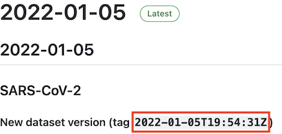

# nf-core/viralrecon: Usage

## :warning: Please read this documentation on the nf-core website: [https://nf-co.re/viralrecon/usage](https://nf-co.re/viralrecon/usage)

> _Documentation of pipeline parameters is generated automatically from the pipeline schema and can no longer be found in markdown files._

## Samplesheet format

### Illumina

You will need to create a samplesheet with information about the samples you would like to analyse before running the pipeline. Use this parameter to specify its location. It has to be a comma-separated file with 3 columns, and a header row as shown in the examples below.

```console
--input '[path to samplesheet file]'
```

The `sample` identifiers have to be the same when you have re-sequenced the same sample more than once (e.g. to increase sequencing depth). The pipeline will concatenate the raw reads before performing any downstream analysis.

A final samplesheet file may look something like the one below. `SAMPLE_1` was sequenced twice in Illumina PE format, `SAMPLE_2` was sequenced once in Illumina SE format.

```console
sample,fastq_1,fastq_2
SAMPLE_1,AEG588A1_S1_L002_R1_001.fastq.gz,AEG588A1_S1_L002_R2_001.fastq.gz
SAMPLE_1,AEG588A1_S1_L003_R1_001.fastq.gz,AEG588A1_S1_L003_R2_001.fastq.gz
SAMPLE_2,AEG588A2_S4_L003_R1_001.fastq.gz,
```

| Column    | Description                                                                                                                |
| --------- | -------------------------------------------------------------------------------------------------------------------------- |
| `sample`  | Custom sample name. This entry will be identical for multiple sequencing libraries/runs from the same sample.              |
| `fastq_1` | Full path to FastQ file for Illumina short reads 1. File has to be gzipped and have the extension ".fastq.gz" or ".fq.gz". |
| `fastq_2` | Full path to FastQ file for Illumina short reads 2. File has to be gzipped and have the extension ".fastq.gz" or ".fq.gz". |

> **NB:** Dashes (`-`) and spaces in sample names are automatically converted to underscores (`_`) to avoid downstream issues in the pipeline.

### Nanopore

You have the option to provide a samplesheet to the pipeline that maps sample ids to barcode ids. This allows you to associate barcode ids to clinical/public database identifiers that can be used to QC or pre-process the data with more appropriate sample names.

```console
--input '[path to samplesheet file]'
```

It has to be a comma-separated file with 2 columns. A final samplesheet file may look something like the one below:

```console
sample,barcode
21X983255,1
70H209408,2
49Y807476,3
70N209581,4
```

| Column    | Description                                                                           |
| --------- | ------------------------------------------------------------------------------------- |
| `sample`  | Custom sample name, one per barcode.                                                  |
| `barcode` | Barcode identifier attributed to that sample during multiplexing. Must be an integer. |

> **NB:** Dashes (`-`) and spaces in sample names are automatically converted to underscores (`_`) to avoid downstream issues in the pipeline.

## Nanopore input format

For Nanopore data the pipeline only supports amplicon-based analysis obtained from primer sets created and maintained by the [ARTIC Network](https://artic.network/). The [artic minion](https://artic.readthedocs.io/en/latest/commands/) tool from the [ARTIC field bioinformatics pipeline](https://github.com/artic-network/fieldbioinformatics) is used to align reads, call variants and to generate the consensus sequence.

### Nanopolish

The default variant caller used by artic minion is [Nanopolish](https://github.com/jts/nanopolish) and this requires that you provide `*.fastq`, `*.fast5` and `sequencing_summary.txt` files as input to the pipeline. These files can typically be obtained after demultiplexing and basecalling the sequencing data using [Guppy](https://nanoporetech.com/nanopore-sequencing-data-analysis) (see [ARTIC SOP docs](https://artic.network/ncov-2019/ncov2019-bioinformatics-sop.html)). This pipeline requires that the files are organised in the format outlined below and gzip compressed files are also accepted:

```console
.
└── fastq_pass
    └── barcode01
        ├── FAP51364_pass_barcode01_97ca62ca_0.fastq
        ├── FAP51364_pass_barcode01_97ca62ca_1.fastq
        ├── FAP51364_pass_barcode01_97ca62ca_2.fastq
        ├── FAP51364_pass_barcode01_97ca62ca_3.fastq
        ├── FAP51364_pass_barcode01_97ca62ca_4.fastq
        ├── FAP51364_pass_barcode01_97ca62ca_5.fastq
    <TRUNCATED>
```

```console
.
└── fast5_pass
    ├── barcode01
        ├── FAP51364_pass_barcode01_97ca62ca_0.fast5
        ├── FAP51364_pass_barcode01_97ca62ca_1.fast5
        ├── FAP51364_pass_barcode01_97ca62ca_2.fast5
        ├── FAP51364_pass_barcode01_97ca62ca_3.fast5
        ├── FAP51364_pass_barcode01_97ca62ca_4.fast5
        ├── FAP51364_pass_barcode01_97ca62ca_5.fast5
    <TRUNCATED>
```

The command to run the pipeline would then be:

```console
nextflow run nf-core/viralrecon \
    --input samplesheet.csv \
    --outdir <OUTDIR> \
    --platform nanopore \
    --genome 'MN908947.3' \
    --primer_set_version 3 \
    --fastq_dir fastq_pass/ \
    --fast5_dir fast5_pass/ \
    --sequencing_summary sequencing_summary.txt \
    -profile <docker/singularity/podman/conda/institute>
```

### Medaka

You also have the option of using [Medaka](https://github.com/nanoporetech/medaka) as an alternative variant caller to Nanopolish via the `--artic_minion_caller medaka` parameter. Medaka is faster than Nanopolish, performs mostly the same and can be run directly from `fastq` input files as opposed to requiring the `fastq`, `fast5` and `sequencing_summary.txt` files required to run Nanopolish. You must provide the appropriate [Medaka model](https://github.com/nanoporetech/medaka#models) via the `--artic_minion_medaka_model` parameter if using `--artic_minion_caller medaka`. The `fastq` files have to be organised in the same way as for Nanopolish as outlined in the section above.

The command to run the pipeline would then be:

```console
nextflow run nf-core/viralrecon \
    --input samplesheet.csv \
    --outdir <OUTDIR> \
    --platform nanopore \
    --genome 'MN908947.3' \
    --primer_set_version 3 \
    --fastq_dir fastq_pass/ \
    --artic_minion_caller medaka \
    --artic_minion_medaka_model r941_min_high_g360 \
    -profile <docker/singularity/podman/conda/institute>
```

## Illumina primer sets

The Illumina processing mode of the pipeline has been tested on numerous different primer sets. Where possible we are trying to collate links and settings for standard primer sets to make it easier to run the pipeline with standard parameter keys. If you are able to get permissions from the vendor/supplier to share the primer information then we would be more than happy to support it within the pipeline.

For SARS-CoV-2 data we recommend using the "MN908947.3" genome because it is supported out-of-the-box by the most commonly used primer sets available from the [ARTIC Network](https://artic.network/). For ease of use, we are also maintaining a version of the "MN908947.3" genome along with the appropriate links to the ARTIC primer sets in the [genomes config file](https://github.com/nf-core/configs/blob/master/conf/pipeline/viralrecon/genomes.config) used by the pipeline. The genomes config file can be updated independently from the main pipeline code to make it possible to dynamically extend this file for other viral genomes/primer sets on request.

For further information or help, don't hesitate to get in touch on the [Slack `#viralrecon` channel](https://nfcore.slack.com/channels/viralrecon) (you can join with [this invite](https://nf-co.re/join/slack)).

### ARTIC primer sets

An example command using v3 ARTIC primers with "MN908947.3":

```console
nextflow run nf-core/viralrecon \
    --input samplesheet.csv \
    --outdir <OUTDIR> \
    --platform illumina \
    --protocol amplicon \
    --genome 'MN908947.3' \
    --primer_set artic \
    --primer_set_version 3 \
    --skip_assembly \
    -profile <docker/singularity/podman/conda/institute>
```

### SWIFT primer sets

The [SWIFT amplicon panel](https://swiftbiosci.com/swift-amplicon-sars-cov-2-panel/) is another commonly used method used to prep and sequence SARS-CoV-2 samples. We haven't been able to obtain explicit permission to host standard SWIFT primer sets but you can obtain a masterfile which is freely available from their website that contains the primer sequences as well as genomic co-ordinates. You just need to convert this file to [BED6](https://genome.ucsc.edu/FAQ/FAQformat.html#format1) format and provide it to the pipeline with `--primer_bed swift_primers.bed`. Be sure to check the values provided to `--primer_left_suffix` and `--primer_right_suffix` match the primer names defined in the BED file as highlighted in [this issue](https://github.com/nf-core/viralrecon/issues/169). For an explanation behind the usage of the `--ivar_trim_offset 5` for SWIFT primer sets see [this issue](https://github.com/nf-core/viralrecon/issues/170).

An example command using SWIFT primers with "MN908947.3":

```console
nextflow run nf-core/viralrecon \
    --input samplesheet.csv \
    --outdir <OUTDIR> \
    --platform illumina \
    --protocol amplicon \
    --genome 'MN908947.3' \
    --primer_bed swift_primers.bed \
    --primer_left_suffix '_F' \
    --primer_right_suffix '_R' \
    --ivar_trim_offset 5 \
    --skip_assembly \
    -profile <docker/singularity/podman/conda/institute>
```

## Running the pipeline

The typical command for running the pipeline is as follows:

```console
nextflow run nf-core/viralrecon --input samplesheet.csv --outdir <OUTDIR> --genome 'MN908947.3' -profile docker
```

This will launch the pipeline with the `docker` configuration profile. See below for more information about profiles.

Note that the pipeline will create the following files in your working directory:

```console
work                # Directory containing the nextflow working files
<OUTIDR>            # Finished results in specified location (defined with --outdir)
.nextflow_log       # Log file from Nextflow
# Other nextflow hidden files, eg. history of pipeline runs and old logs.
```

### Updating the pipeline

When you run the above command, Nextflow automatically pulls the pipeline code from GitHub and stores it as a cached version. When running the pipeline after this, it will always use the cached version if available - even if the pipeline has been updated since. To make sure that you're running the latest version of the pipeline, make sure that you regularly update the cached version of the pipeline:

```console
nextflow pull nf-core/viralrecon
```

### Reproducibility

It is a good idea to specify a pipeline version when running the pipeline on your data. This ensures that a specific version of the pipeline code and software are used when you run your pipeline. If you keep using the same tag, you'll be running the same version of the pipeline, even if there have been changes to the code since.

First, go to the [nf-core/viralrecon releases page](https://github.com/nf-core/viralrecon/releases) and find the latest version number - numeric only (eg. `1.3.1`). Then specify this when running the pipeline with `-r` (one hyphen) - eg. `-r 1.3.1`.

This version number will be logged in reports when you run the pipeline, so that you'll know what you used when you look back in the future.

## Core Nextflow arguments

> **NB:** These options are part of Nextflow and use a _single_ hyphen (pipeline parameters use a double-hyphen).

### `-profile`

Use this parameter to choose a configuration profile. Profiles can give configuration presets for different compute environments.

Several generic profiles are bundled with the pipeline which instruct the pipeline to use software packaged using different methods (Docker, Singularity, Podman, Shifter, Charliecloud, Conda) - see below. When using Biocontainers, most of these software packaging methods pull Docker containers from quay.io e.g [FastQC](https://quay.io/repository/biocontainers/fastqc) except for Singularity which directly downloads Singularity images via https hosted by the [Galaxy project](https://depot.galaxyproject.org/singularity/) and Conda which downloads and installs software locally from [Bioconda](https://bioconda.github.io/).

> We highly recommend the use of Docker or Singularity containers for full pipeline reproducibility, however when this is not possible, Conda is also supported.

The pipeline also dynamically loads configurations from [https://github.com/nf-core/configs](https://github.com/nf-core/configs) when it runs, making multiple config profiles for various institutional clusters available at run time. For more information and to see if your system is available in these configs please see the [nf-core/configs documentation](https://github.com/nf-core/configs#documentation).

Note that multiple profiles can be loaded, for example: `-profile test,docker` - the order of arguments is important!
They are loaded in sequence, so later profiles can overwrite earlier profiles.

If `-profile` is not specified, the pipeline will run locally and expect all software to be installed and available on the `PATH`. This is _not_ recommended.

- `docker`
  - A generic configuration profile to be used with [Docker](https://docker.com/)
- `singularity`
  - A generic configuration profile to be used with [Singularity](https://sylabs.io/docs/)
- `podman`
  - A generic configuration profile to be used with [Podman](https://podman.io/)
- `shifter`
  - A generic configuration profile to be used with [Shifter](https://nersc.gitlab.io/development/shifter/how-to-use/)
- `charliecloud`
  - A generic configuration profile to be used with [Charliecloud](https://hpc.github.io/charliecloud/)
- `conda`
  - A generic configuration profile to be used with [Conda](https://conda.io/docs/). Please only use Conda as a last resort i.e. when it's not possible to run the pipeline with Docker, Singularity, Podman, Shifter or Charliecloud.
- `test`
  - A profile with a complete configuration for automated testing
  - Includes links to test data so needs no other parameters

### `-resume`

Specify this when restarting a pipeline. Nextflow will use cached results from any pipeline steps where the inputs are the same, continuing from where it got to previously. For input to be considered the same, not only the names must be identical but the files' contents as well. For more info about this parameter, see [this blog post](https://www.nextflow.io/blog/2019/demystifying-nextflow-resume.html).

You can also supply a run name to resume a specific run: `-resume [run-name]`. Use the `nextflow log` command to show previous run names.

### `-c`

Specify the path to a specific config file (this is a core Nextflow command). See the [nf-core website documentation](https://nf-co.re/usage/configuration) for more information.

## Custom configuration

### Resource requests

Whilst the default requirements set within the pipeline will hopefully work for most people and with most input data, you may find that you want to customise the compute resources that the pipeline requests. Each step in the pipeline has a default set of requirements for number of CPUs, memory and time. For most of the steps in the pipeline, if the job exits with any of the error codes specified [here](https://github.com/nf-core/rnaseq/blob/4c27ef5610c87db00c3c5a3eed10b1d161abf575/conf/base.config#L18) it will automatically be resubmitted with higher requests (2 x original, then 3 x original). If it still fails after the third attempt then the pipeline execution is stopped.

For example, if the nf-core/rnaseq pipeline is failing after multiple re-submissions of the `STAR_ALIGN` process due to an exit code of `137` this would indicate that there is an out of memory issue:

```console
[62/149eb0] NOTE: Process `NFCORE_RNASEQ:RNASEQ:ALIGN_STAR:STAR_ALIGN (WT_REP1)` terminated with an error exit status (137) -- Execution is retried (1)
Error executing process > 'NFCORE_RNASEQ:RNASEQ:ALIGN_STAR:STAR_ALIGN (WT_REP1)'

Caused by:
    Process `NFCORE_RNASEQ:RNASEQ:ALIGN_STAR:STAR_ALIGN (WT_REP1)` terminated with an error exit status (137)

Command executed:
    STAR \
        --genomeDir star \
        --readFilesIn WT_REP1_trimmed.fq.gz  \
        --runThreadN 2 \
        --outFileNamePrefix WT_REP1. \
        <TRUNCATED>

Command exit status:
    137

Command output:
    (empty)

Command error:
    .command.sh: line 9:  30 Killed    STAR --genomeDir star --readFilesIn WT_REP1_trimmed.fq.gz --runThreadN 2 --outFileNamePrefix WT_REP1. <TRUNCATED>
Work dir:
    /home/pipelinetest/work/9d/172ca5881234073e8d76f2a19c88fb

Tip: you can replicate the issue by changing to the process work dir and entering the command `bash .command.run`
```

To bypass this error you would need to find exactly which resources are set by the `STAR_ALIGN` process. The quickest way is to search for `process STAR_ALIGN` in the [nf-core/rnaseq Github repo](https://github.com/nf-core/rnaseq/search?q=process+STAR_ALIGN).
We have standardised the structure of Nextflow DSL2 pipelines such that all module files will be present in the `modules/` directory and so, based on the search results, the file we want is `modules/nf-core/software/star/align/main.nf`.
If you click on the link to that file you will notice that there is a `label` directive at the top of the module that is set to [`label process_high`](https://github.com/nf-core/rnaseq/blob/4c27ef5610c87db00c3c5a3eed10b1d161abf575/modules/nf-core/software/star/align/main.nf#L9).
The [Nextflow `label`](https://www.nextflow.io/docs/latest/process.html#label) directive allows us to organise workflow processes in separate groups which can be referenced in a configuration file to select and configure subset of processes having similar computing requirements.
The default values for the `process_high` label are set in the pipeline's [`base.config`](https://github.com/nf-core/rnaseq/blob/4c27ef5610c87db00c3c5a3eed10b1d161abf575/conf/base.config#L33-L37) which in this case is defined as 72GB.
Providing you haven't set any other standard nf-core parameters to **cap** the [maximum resources](https://nf-co.re/usage/configuration#max-resources) used by the pipeline then we can try and bypass the `STAR_ALIGN` process failure by creating a custom config file that sets at least 72GB of memory, in this case increased to 100GB.
The custom config below can then be provided to the pipeline via the [`-c`](#-c) parameter as highlighted in previous sections.

```nextflow
process {
    withName: 'NFCORE_RNASEQ:RNASEQ:ALIGN_STAR:STAR_ALIGN' {
        memory = 100.GB
    }
}
```

> **NB:** We specify the full process name i.e. `NFCORE_RNASEQ:RNASEQ:ALIGN_STAR:STAR_ALIGN` in the config file because this takes priority over the short name (`STAR_ALIGN`) and allows existing configuration using the full process name to be correctly overridden.
>
> If you get a warning suggesting that the process selector isn't recognised check that the process name has been specified correctly.

### Updating containers

The [Nextflow DSL2](https://www.nextflow.io/docs/latest/dsl2.html) implementation of this pipeline uses one container per process which makes it much easier to maintain and update software dependencies. If for some reason you need to use a different version of a particular tool with the pipeline then you just need to identify the `process` name and override the Nextflow `container` definition for that process using the `withName` declaration.

#### Pangolin

For example, in the [nf-core/viralrecon](https://nf-co.re/viralrecon) pipeline a tool called [Pangolin](https://github.com/cov-lineages/pangolin) has been used during the COVID-19 pandemic to assign lineages to SARS-CoV-2 genome sequenced samples. Given that the lineage assignments change quite frequently it doesn't make sense to re-release the nf-core/viralrecon everytime a new version of Pangolin has been released. However, you can override the default container used by the pipeline by creating a custom config file and passing it as a command-line argument via `-c custom.config`.

1. Check the default version used by the pipeline in the module file for [Pangolin](https://github.com/nf-core/viralrecon/blob/a85d5969f9025409e3618d6c280ef15ce417df65/modules/nf-core/software/pangolin/main.nf#L14-L19)
2. Find the latest version of the Biocontainer available on [Quay.io](https://quay.io/repository/biocontainers/pangolin?tag=latest&tab=tags)
3. Create the custom config accordingly:

   - For Docker:

     ```nextflow
     process {
         withName: PANGOLIN {
             container = 'quay.io/biocontainers/pangolin:3.1.17--pyhdfd78af_1'
         }
     }
     ```

   - For Singularity:

     ```nextflow
     process {
         withName: PANGOLIN {
             container = 'https://depot.galaxyproject.org/singularity/pangolin:3.1.17--pyhdfd78af_1'
         }
     }
     ```

   - For Conda:

     ```nextflow
     process {
         withName: PANGOLIN {
             conda = 'bioconda::pangolin=3.1.17'
         }
     }
     ```

#### Nextclade

You can use a similar approach to update the version of Nextclade used by the pipeline:

1. Check the default version used by the pipeline in the module file for [Nextclade](https://github.com/nf-core/viralrecon/blob/e582db9c70721aae530703ec9a2ab8b219c96a99/modules/nf-core/modules/nextclade/run/main.nf#L5-L8)
2. Find the latest version of the Biocontainer available on [Quay.io](https://quay.io/repository/biocontainers/nextclade?tag=latest&tab=tags)
3. Create the custom config accordingly:

   - For Docker:

     ```nextflow
     process {
         withName: 'NEXTCLADE_DATASETGET|NEXTCLADE_RUN' {
             container = 'quay.io/biocontainers/nextclade:1.10.1--h9ee0642_0'
         }
     }
     ```

   - For Singularity:

     ```nextflow
     process {
         withName: 'NEXTCLADE_DATASETGET|NEXTCLADE_RUN' {
             container = 'https://depot.galaxyproject.org/singularity/nextclade:1.10.1--h9ee0642_0'
         }
     }
     ```

   - For Conda:

     ```nextflow
     process {
         withName: 'NEXTCLADE_DATASETGET|NEXTCLADE_RUN' {
             conda = 'bioconda::nextclade=1.10.1'
         }
     }
     ```

##### Nextclade datasets

A [`nextclade dataset`](https://docs.nextstrain.org/projects/nextclade/en/latest/user/datasets.html#nextclade-datasets) feature was introduced in [Nextclade CLI v1.3.0](https://github.com/nextstrain/nextclade/releases/tag/1.3.0) that fetches input genome files such as reference sequences and trees from a central dataset repository. We have uploaded Nextclade dataset [v2022-01-18](https://github.com/nextstrain/nextclade_data/releases/tag/2022-01-24--21-27-29--UTC) to [nf-core/test-datasets](https://github.com/nf-core/test-datasets/blob/viralrecon/genome/MN908947.3/nextclade_sars-cov-2_MN908947_2022-01-18T12_00_00Z.tar.gz?raw=true), and for reproducibility, this will be used by default if you specify `--genome 'MN908947.3'` when running the pipeline. However, there are a number of ways you can use a more recent version of the dataset:

- Supply your own by setting: `--nextclade_dataset <PATH_TO_DATASET>`
- Let the pipeline create and use the latest version by setting: `--nextclade_dataset false --nextclade_dataset_tag false`
- Let the pipeline create and use a specific, tagged version by setting: `--nextclade_dataset false --nextclade_dataset_tag <DATASET_TAG>`

The Nextclade dataset releases can be found on their [Github page](https://github.com/nextstrain/nextclade_data/releases). Use the tag specified for each release e.g `2022-01-18T12:00:00Z` in the example below:



If the `--save_reference` parameter is provided then the Nextclade dataset generated by the pipeline will also be saved in the `results/genome/` directory.

> **NB:** If you wish to periodically update individual tool-specific results (e.g. Pangolin) generated by the pipeline then you must ensure to keep the `work/` directory otherwise the `-resume` ability of the pipeline will be compromised and it will restart from scratch.

### nf-core/configs

In most cases, you will only need to create a custom config as a one-off but if you and others within your organisation are likely to be running nf-core pipelines regularly and need to use the same settings regularly it may be a good idea to request that your custom config file is uploaded to the `nf-core/configs` git repository. Before you do this please can you test that the config file works with your pipeline of choice using the `-c` parameter. You can then create a pull request to the `nf-core/configs` repository with the addition of your config file, associated documentation file (see examples in [`nf-core/configs/docs`](https://github.com/nf-core/configs/tree/master/docs)), and amending [`nfcore_custom.config`](https://github.com/nf-core/configs/blob/master/nfcore_custom.config) to include your custom profile.

See the main [Nextflow documentation](https://www.nextflow.io/docs/latest/config.html) for more information about creating your own configuration files.

If you have any questions or issues please send us a message on [Slack](https://nf-co.re/join/slack) on the [`#configs` channel](https://nfcore.slack.com/channels/configs).

## Running in the background

Nextflow handles job submissions and supervises the running jobs. The Nextflow process must run until the pipeline is finished.

The Nextflow `-bg` flag launches Nextflow in the background, detached from your terminal so that the workflow does not stop if you log out of your session. The logs are saved to a file.

Alternatively, you can use `screen` / `tmux` or similar tool to create a detached session which you can log back into at a later time.
Some HPC setups also allow you to run nextflow within a cluster job submitted your job scheduler (from where it submits more jobs).

## Nextflow memory requirements

In some cases, the Nextflow Java virtual machines can start to request a large amount of memory.
We recommend adding the following line to your environment to limit this (typically in `~/.bashrc` or `~./bash_profile`):

```console
NXF_OPTS='-Xms1g -Xmx4g'
```
